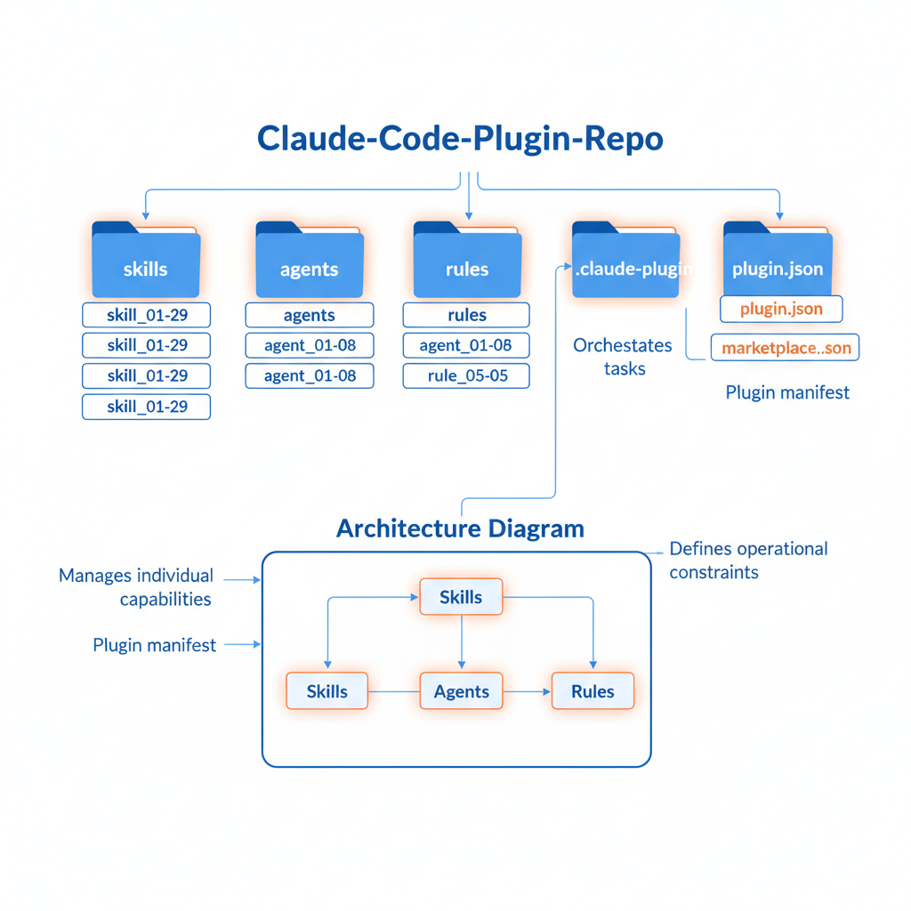
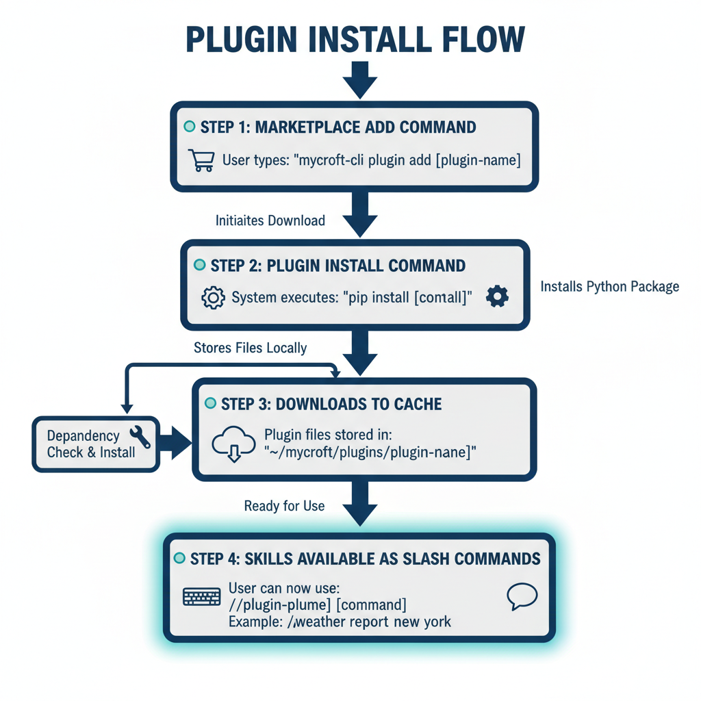

# 🎓 Understanding the Claude Code Power Pack

## 📌 TL;DR
> A **collection of skills, agents, and rules** that makes Claude Code smarter. Think of it like equipping a game character with new abilities!

## 🎯 What We Built

### A Simple Analogy...

Think of **Claude Code as a smartphone**.

- **Skills** = Apps (like iMessage, YouTube — each does something specific)
- **Agents** = Specialized assistants like Siri or Alexa (experts in specific domains)
- **Rules** = Phone settings (rules that define how things should work)

This repository is an **all-in-one package** that installs **29 apps (skills)**, **8 specialist assistants (agents)**, and **5 rules** into Claude Code at once!

---

## 🖼️ Visual Resources

### Repository Structure


> The repository is organized into 4 main folders:
> - `skills/` - 29 skills (used via slash commands)
> - `agents/` - 8 specialized agents
> - `rules/` - 5 coding rules
> - `.claude-plugin/` - Plugin configuration files

### Installation Flow


> Installation is just 2 steps!
> 1. Add the marketplace
> 2. Install the plugin
> Done! You can start using skills right away 🎉

---

## 🧱 Core Concepts

### Concept 1: Skills

**Analogy:** Just like **apps** on your smartphone!

The same way you open iMessage to send a message, you can use the `/ccpp:plan` skill to create a work plan.

**In practice:**
```bash
/ccpp:plan          # Create a work plan
/ccpp:verify        # Run test/lint verification
/ccpp:commit-push-pr  # Automate from commit to PR
```

**Why do you need this?**
Instead of repeating the same tasks over and over, you can automate them with a single skill. Time saver!

---

### Concept 2: Agents

**Analogy:** Like having **specialist team members** at a company!

- `frontend-developer` = Frontend expert
- `code-reviewer` = Code review expert
- `junior-mentor` = Junior developer educator

**In practice:**
```
"Use the frontend-developer agent to build a login page"
"Use code-reviewer to review this PR"
"Use junior-mentor to explain this code"
```

**Why do you need this?**
You get answers that are **specialized in a specific domain** — better than generic Claude responses. It's like consulting a subject-matter expert!

---

### Concept 3: Rules

**Analogy:** Like a company's **coding conventions document**!

When a new hire joins, they receive a document saying "Here's how we write code at our company." Rules are exactly that.

**Included rules:**
| File | Content |
|------|---------|
| `coding-style.md` | Code style (immutability, file size, etc.) |
| `git-workflow.md` | Git branching strategy, commit message format |
| `testing.md` | Test writing guidelines |
| `performance.md` | Performance optimization guide |
| `security.md` | Security checklist |

**Why do you need this?**
When Claude writes code, it follows these rules to produce code with **consistent quality**.

---

### Concept 4: Plugin System

**Analogy:** Just like installing apps from the App Store!

1. **Marketplace** = App Store
2. **Plugin** = App
3. **Install** = Download

**Folder structure:**
```
.claude-plugin/
├── plugin.json      # Plugin info (app description)
└── marketplace.json # Marketplace registration info
```

---

## 📁 Folder Breakdown

### `skills/` Folder
**Role:** Features accessible via slash commands

```
skills/
├── plan/           # /ccpp:plan - Work planning
├── verify/         # /ccpp:verify - Verification
├── review/         # /ccpp:review - Code review
├── react-patterns/ # React pattern reference
├── nano-banana/    # Image generation
└── ... (29 total)
```

Each skill folder contains a `SKILL.md` file. This file is the skill's "user manual"!

### `agents/` Folder
**Role:** Domain-expert AIs

```
agents/
├── planner.md           # Planning expert
├── frontend-developer.md # Frontend expert
├── junior-mentor.md     # Junior mentor
├── code-reviewer.md     # Code reviewer
├── architect.md         # Architect
├── security-reviewer.md # Security expert
├── tdd-guide.md         # TDD guide
└── stitch-developer.md  # Stitch UI expert
```

### `rules/` Folder
**Role:** Coding rules that Claude must follow

```
rules/
├── coding-style.md  # Coding style
├── git-workflow.md  # Git workflow
├── testing.md       # Testing rules
├── performance.md   # Performance guide
└── security.md      # Security rules
```

---

## 🔄 Data Flow

```
User enters command → Claude Code loads skill → Executes as defined in skill → Outputs result
      👆                      👆                          👆                    👆
  "/ccpp:plan"      skills/plan/SKILL.md          Planning logic         Plan generated
```

### Plugin Installation Flow
```
1. claude plugin marketplace add jh941213/my-claude-code-asset
   └→ Downloads repository info from GitHub

2. claude plugin install ccpp@my-claude-code-asset
   └→ All skills in the skills/ folder become available

3. Restart Claude Code
   └→ /ccpp:plan, /ccpp:verify, etc. are ready to use!
```

---

## ⚠️ Common Beginner Mistakes

### Mistake 1: Confusing Plugin Install with Full Setup

```bash
# ❌ Installing just the plugin won't include agents and rules!
claude plugin install ccpp@my-claude-code-asset

# ✅ If you need agents and rules too, copy them separately
curl -fsSL https://raw.githubusercontent.com/.../install.sh | bash
```

**Why?** The Claude Code plugin system currently only supports `skills`. Agents and rules must be manually copied to the `~/.claude/` folder.

### Mistake 2: Typos in Commands

```bash
# ❌ plugins (plural)
claude plugins install ...

# ✅ plugin (singular)
claude plugin install ...
```

### Mistake 3: Forgetting to Add the Marketplace

```bash
# ❌ Trying to install directly will cause an error!
claude plugin install ccpp@my-claude-code-asset

# ✅ You need to add the marketplace first
claude plugin marketplace add jh941213/my-claude-code-asset
claude plugin install ccpp@my-claude-code-asset
```

---

## 🎮 Try It Yourself

### Experiment 1: Check Available Skills
In Claude Code, type `/` and then `ccpp`. You'll see a list of available skills!

### Experiment 2: Use a Simple Skill
```
/ccpp:plan Build a login feature
```
→ A plan is automatically generated!

### Experiment 3: Use an Agent
```
"Use the junior-mentor agent to explain React useState"
```
→ You get an easy-to-understand explanation with analogies + an EXPLANATION.md file!

### Experiment 4: Generate Images (nano-banana)
```
/ccpp:nano-banana Create a login flow diagram
```
→ A visual diagram is generated!

---

## 📚 Want to Learn More?

| Topic | Link |
|-------|------|
| Claude Code Official Docs | https://docs.anthropic.com/claude-code |
| How to Write Skills | Refer to the SKILL.md file format |
| Boris Cherny Tips | See the "Boris Cherny Tips" section in README.md |

---

## 📊 Current Repository Stats

| Item | Count | Description |
|------|-------|-------------|
| Skills | 29 | Workflow 13 + Tech 10 + E2E/Stitch 5 + Image 1 |
| Agents | 8 | Domain-specific AI agents |
| Rules | 5 | Coding conventions and guidelines |

---

*This document was auto-generated by the junior-mentor agent* 🎓
