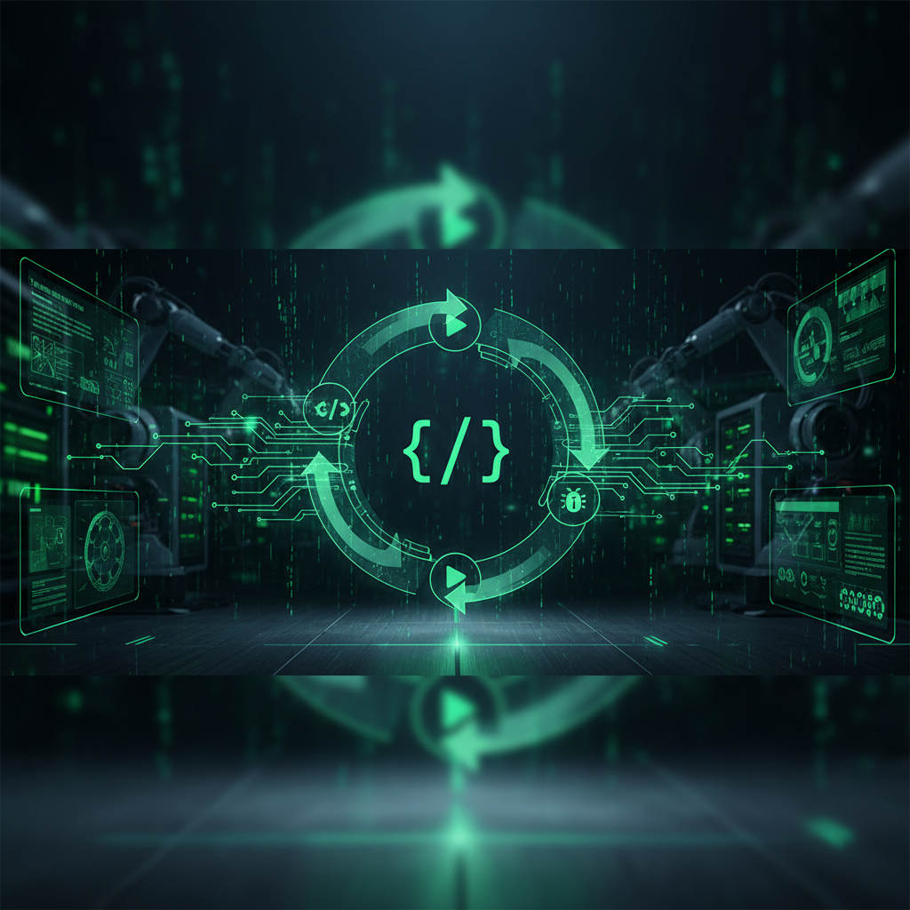

<div align="center">

**🌐 [English](README_EN.md) | 한국어**

# Claude Code Power Pack


[](https://github.com/jh941213/my-claude-code-asset)
[](LICENSE)
[](#-스킬-33개)
[](#-에이전트-11개)
[](#-prd-aletheia-v2)
[](#-tth-멀티-에이전트-사일로)
[](#-autodev-자율-실험-루프)

**실무에서 바로 쓸 수 있는 Claude Code 최적 에이전트 하네스**

`Skills` `Agents` `Hooks` `Rules` `Commands` `TTH` 올인원

---

**33개 스킬** | **11개 에이전트** | **5개 조건부 Rules** | **Hooks 보장 시스템** | **TTH 멀티 에이전트** | **AutoDev 자율 실험**

</div>

---

## 목차

- [설치](#-설치)
- [PRD Aletheia v2](#-prd-aletheia-v2)
- [TTH 멀티 에이전트 사일로](#-tth-멀티-에이전트-사일로)
- [AutoDev 자율 실험 루프](#-autodev-자율-실험-루프)
- [CLAUDE.md 최적화 철학](#-claudemd-최적화-철학)
- [Hooks 보장 시스템](#-hooks-보장-시스템)
- [스킬 (33개)](#-스킬-33개)
- [에이전트 (11개)](#-에이전트-11개)
- [Commands (3개)](#-commands-3개)
- [Rules (5개)](#-rules-5개-조건부-로드)
- [Boris Cherny 팁](#-boris-cherny-팁)
- [Codex CLI 버전](#-codex-cli-버전)
- [참고 자료](#-참고-자료)
- [Changelog](#-changelog)

---

## 🚀 설치

### 방법 1: 원클릭 전체 설치 (권장)

```bash
curl -fsSL https://raw.githubusercontent.com/jh941213/my-claude-code-asset/main/install.sh | bash
```

### 방법 2: 플러그인 설치 (Skills만)

```bash
claude plugin marketplace add jh941213/my-claude-code-asset
claude plugin install ccpp@my-claude-code-asset
```

> **Note**: 플러그인 시스템은 **skills만** 지원합니다. 에이전트, rules, TTH는 별도 설정이 필요합니다.

### 방법 3: Claude에게 직접 요청

```
https://github.com/jh941213/my-claude-code-asset 저장소의 agents/, rules/, commands/, CLAUDE.md를
내 ~/.claude/ 폴더에 반영해줘
```

### 설치 항목 비교

| 항목 | 플러그인 설치 | 전체 설정 |
|------|:---:|:---:|
| Skills (33개) | ✅ | ✅ |
| Agents (11개) | ❌ | ✅ |
| Rules (5개) | ❌ | ✅ |
| Commands (3개) | ❌ | ✅ |
| TTH Team Roles (6개) | ❌ | ✅ |
| TTH Hooks (2개) | ❌ | ✅ |
| CLAUDE.md | ❌ | ✅ |
| settings.json | ❌ | ✅ |

---

## 📋 PRD Aletheia v2

<div align="center">

</div>

> **인문학 프레임워크 + Six Thinking Hats + 수렴 보드 = 인사이트 중심 PRD**

`/prd "아이디어"` 한 줄로 복잡도 적응적 인터뷰부터 PRD 문서 생성까지 자동화합니다.

```
/prd "개발자를 위한 AI 코드 리뷰 SaaS"
```

### 핵심 혁신

| 요소 | 설명 |
|------|------|
| **복잡도 게이트** | Low/Mid/High 자동 판정 → 프로세스 적응 (2~5라운드) |
| **수렴 보드** | 6차원 진행 추적 (🔴→🟡→🟢) — 용어, 구조, 깊이, 일관성, 견고성, 시장 |
| **인문학 프레임워크** | 비트겐슈타인(용어정렬) + 데카르트(방법적 회의) + 소크라테스(모순탐지) + 조하리(맹점) + 가다머(정합성) |
| **Graceful Exit** | 언제든 중간 이탈 → PRD.partial.md 저장 → 다음 세션 이어서 진행 |

### 파이프라인

```
Phase 0: 복잡도 판정 + 수렴 보드 초기화
    ↓
Phase 1 (bg) ──┐  시장 리서치 서브에이전트 (Tavily/Exa/Gemini CLI)
Phase 2 R1 ────┘  용어 정렬 + W6H 구조 스캔 (병렬)
    ↓
Phase 2 R2-5: 적응적 인터뷰 (리서치 합류)
    ↓
Phase 3-5: prd-planner 서브에이전트에 위임
    ├── Six Hats 합성 + 차별화 전략
    ├── MVP 경계선 + 위험 분석
    └── PRD.md 작성 (수렴 보드 부록 포함)
    ↓
Phase 6: 자가 검증 → /spec 연결
```

### 복잡도별 적응

| 복잡도 | 예시 | Phase 1 | 인터뷰 |
|--------|------|---------|--------|
| **Low** | CLI 도구, 단순 기능 | 스킵 | 2라운드 |
| **Mid** | 새 모듈, 라이브러리 | 서브에이전트 1개 | 3라운드 |
| **High** | SaaS, 플랫폼 | 서브에이전트 3개 병렬 | 5라운드 |

### PRD → SPEC → 구현

```
/prd [아이디어]  → PRD.md (무엇을, 왜)
/spec            → SPEC.md (어떻게 — 기술 상세)
/tth             → 멀티 에이전트로 자율 구현
```

---

## 🤖 TTH 멀티 에이전트 사일로

<div align="center">

</div>

> **Toss 사일로 + Tesla 5-Step + Ralph Loop = 자율 멀티 에이전트 팀**

`/tth "기능 설명"` 한 줄로 M7 CEO 페르소나 팀이 자율적으로 협업합니다.

```
/tth "TODO 앱 만들어줘"
```

### 3축 통합

| 축 | 원출처 | 역할 |
|---|---|---|
| **Toss 사일로** | 토스 조직문화 | DRI 구조, 파일 경계, 자율 의사결정 |
| **Tesla 5-Step** | 머스크 | 의심 → 삭제 → 단순화 → 가속 → 자동화 |
| **Ralph Loop** | ghuntley/ralph | 반복 수렴, backpressure, progress.txt 학습 |

### 팀 구성 (M7 CEO 매핑)

| 역할 | 이름 | CEO 철학 |
|------|------|----------|
| PO/Team Lead | **사티아** (Satya Nadella) | Growth Mindset, 팀 임파워먼트 |
| Architect | **피차이** (Sundar Pichai) | Platform Thinking, 10x Thinking, Simplicity at Scale |
| Designer/UX | **팀쿡** (Tim Cook) | Apple 디자인 철학, 완벽주의 |
| Frontend | **저커버그** (Mark Zuckerberg) | Move Fast, 프로덕트 중심 |
| Backend | **젠슨** (Jensen Huang) | Intellectual Honesty, 기술적 깊이 |
| QA | **베조스** (Jeff Bezos) | Customer Obsession, "?" 이메일 |

### Long-Horizon 실행 패턴

3단계 이상 또는 멀티세션 작업 시, 내구성 있는 프로젝트 메모리를 자동 생성합니다:

| 파일 | 관리자 | 목적 |
|------|--------|------|
| `CHECKPOINT.md` | 사티아 (생성) + 피차이 (검증 커맨드) | 마일스톤 정의 + 검증 + done-when |
| `AUDIT.log` | 사티아 (기록) + 베조스 (게이트) | append-only 이벤트 스트림 |
| `progress.txt` | 전체 팀 | 패턴, gotcha, 실패 교훈 |

### 파이프라인

```
Phase 0: 사티아 활성화 (PO 모드)
    ↓
Phase 1: 요구사항 의심 (Musk Step 1)
    ↓
Phase 2: 동적 팀 선발 + 스토리 분해 + CHECKPOINT.md 생성
    ↓
Phase 3: Ralph Loop 병렬 실행
         (자체 검증 → pass/fail → 재시도 → 학습 누적)
         마일스톤마다 AUDIT.log 기록
    ↓
Phase 4: 통합 & 리뷰 (베조스 마일스톤 게이트 검증)
    ↓
Phase 5: HANDOFF.md + TeamDelete
```

### 프로젝트 유형별 자동 팀 선발

| 유형 | 팀원 |
|------|------|
| 백엔드 전용 | 피차이 + 젠슨 + 베조스 |
| 프론트엔드 전용 | 팀쿡 + 저커버그 + 베조스 |
| 풀스택 | 피차이 + 팀쿡 + 저커버그 + 젠슨 + 베조스 |
| UI 리디자인 | 팀쿡 + 저커버그 |
| 코드 리뷰/감사 | 베조스 단독 |
| 아키텍처 리팩토링 | 피차이 + 베조스 |

### TTH 파일 구조

```
~/.claude/
├── commands/tth.md           ← /tth 슬래시 커맨드 (오케스트레이션)
├── team-roles/
│   ├── satya.md              ← PO/리드 (Opus) — CHECKPOINT.md, AUDIT.log 관리
│   ├── pichai.md             ← 아키텍트 (Opus) — 마일스톤 검증 커맨드 정의
│   ├── tim-cook.md           ← 디자이너 (Sonnet)
│   ├── zuckerberg.md         ← 프론트엔드 (Sonnet)
│   ├── jensen.md             ← 백엔드 (Sonnet)
│   └── bezos.md              ← QA (Sonnet) — 마일스톤 게이트 최종 검증
├── hooks/
│   ├── verify-task-quality.sh ← TaskCompleted 품질 게이트
│   ├── check-architecture.sh  ← 아키텍처 불변성 체크
│   ├── check-remaining-tasks.sh ← TeammateIdle 유휴 방지
│   └── autodev-judge.sh       ← AutoDev 스코어 판정
└── skills/
    ├── autodev/SKILL.md       ← 자율 실험 루프
    └── autodev-parallel/SKILL.md ← 병렬 워크트리 오케스트레이터
```

> **요구사항**: `CLAUDE_CODE_EXPERIMENTAL_AGENT_TEAMS=1` 환경변수 필요 (settings.json에 포함됨)

---

## 🔬 AutoDev 자율 실험 루프

<div align="center">

</div>

> **Karpathy의 [autoresearch](https://github.com/karpathy/autoresearch) 패턴을 일반 소프트웨어 개발에 적용**

AI 에이전트가 코드를 수정하고, 테스트/빌드로 검증하고, keep/discard를 반복하며 **자율적으로 코드를 개선**합니다.
사람이 자는 동안 수십 번의 실험을 자동으로 수행합니다.

```
/autodev
> goal: "실패하는 테스트 전부 통과시켜"
> scope: ["src/**"]
> budget: 50
```

### autoresearch → AutoDev 매핑

| autoresearch | AutoDev |
|---|---|
| `val_bpb` (단일 지표) | `autodev-judge.sh` (빌드/테스트/린트 종합 스코어) |
| `train.py` 1개 파일 | scope 내 파일들 |
| `program.md` | `/autodev` 스킬 |
| 5분 학습 | `npm test` / `pytest` |
| `results.tsv` | `.autodev/results.tsv` |
| NEVER STOP | budget 소진까지 NEVER STOP |

### 실험 루프

```
LOOP (budget 소진까지):
  1. 코드 수정 (scope 내 파일만)
  2. git commit
  3. 테스트/빌드 실행
  4. 스코어 계산 (autodev-judge.sh)
  5. 향상 → KEEP (브랜치 전진)
     악화 → DISCARD (git reset)
  6. 반복
```

### 병렬 모드 (`/autodev-parallel`)

여러 아이디어를 git worktree로 **동시에** 실험합니다.

```
/autodev-parallel
> goal: "API 응답시간 최적화"
> scope: ["src/api/**"]
> parallel: 3
> rounds: 5
```

```
main
 ├── worktree A ── Agent 1: 캐시 레이어 추가
 ├── worktree B ── Agent 2: 쿼리 최적화
 ├── worktree C ── Agent 3: 인덱스 변경
 └── Orchestrator: 결과 수집 → 최고 브랜치 cherry-pick
```

### 적합한 사용 사례

| 시나리오 | 지표 |
|----------|------|
| 실패 테스트 일괄 수정 | 테스트 통과율 |
| 성능 최적화 탐색 | 벤치마크 / Lighthouse |
| TypeScript strict 마이그레이션 | 타입 에러 수 |
| 의존성 메이저 업그레이드 | 빌드 + 테스트 통과 |
| 레거시 리팩토링 | 테스트 유지 + 코드 줄 수 |

### AutoDev 파일 구조

```
~/.claude/
├── skills/
│   ├── autodev/SKILL.md          ← 단일 실험 루프
│   └── autodev-parallel/SKILL.md ← 병렬 워크트리 오케스트레이터
└── hooks/
    └── autodev-judge.sh          ← 스코어 판정 함수
```

---

## 📐 CLAUDE.md 최적화 철학

> ETH Zurich 논문 + Anthropic 공식 가이드 기반

**"Claude가 코드를 읽어도 알 수 없는 것만 적어라."**

- 200줄 이내 (현재 140줄)
- 발견 가능한 정보 제거 (스킬 목록, 에이전트 목록, 코드베이스 개요)
- 린터로 강제 가능한 규칙은 hooks로 이동
- Auto Memory(MEMORY.md)와 역할 분리

---

## 🔒 Hooks 보장 시스템

CLAUDE.md의 "제안"을 settings.json의 "보장"으로 격상:

| 규칙 | 방식 | Hook 유형 |
|------|------|-----------|
| main/master push 금지 | 물리적 차단 | PreToolUse |
| force push 금지 | 물리적 차단 | PreToolUse |
| .env 커밋 금지 | 물리적 차단 | PreCommit |
| console.log 커밋 금지 | 경고 + 차단 | PreCommit |
| prettier 자동 포맷팅 | 자동 실행 | PostToolUse |
| TTH 태스크 완료 시 typecheck/lint/test | 품질 게이트 | TaskCompleted |
| 아키텍처 불변성 위반 감지 | 구조 보호 | TaskCompleted |
| TTH 팀원 유휴 시 남은 태스크 확인 | 유휴 방지 | TeammateIdle |
| 서브에이전트 완료 시 PRD.md 생성 확인 | 생성 알림 | SubagentStop |
| AutoDev 스코어 판정 | 빌드/테스트/린트 종합 스코어 | autodev-judge.sh |

---

## 🛠 스킬 (33개)

### 자율 실험 스킬 (2개)

| 스킬 | 용도 |
|------|------|
| `/ccpp:autodev` | 자율 코드 실험 루프 (autoresearch 패턴) |
| `/ccpp:autodev-parallel` | 병렬 워크트리 실험 오케스트레이터 |

### 워크플로우 스킬 (15개)

| 스킬 | 용도 |
|------|------|
| `/ccpp:plan` | 작업 계획 수립 |
| `/ccpp:spec` | SPEC 기반 개발 - 심층 인터뷰로 명세서 작성 |
| `/ccpp:spec-verify` | 명세서 기반 구현 검증 |
| `/ccpp:frontend` | 빅테크 스타일 UI 개발 |
| `/ccpp:verify` | 테스트, 린트, 빌드 검증 |
| `/ccpp:e2e-verify` | 피처 기반 E2E 테스트 검증 |
| `/ccpp:commit-push-pr` | 커밋 → 푸시 → PR |
| `/ccpp:review` | 코드 리뷰 |
| `/ccpp:simplify` | 코드 단순화 |
| `/ccpp:tdd` | 테스트 주도 개발 |
| `/ccpp:build-fix` | 빌드 에러 수정 |
| `/ccpp:handoff` | HANDOFF.md 세션 인계 |
| `/ccpp:compact-guide` | 컨텍스트 관리 가이드 |
| `/ccpp:techdebt` | 기술 부채 정리 |
| `/ccpp:harness-diagnostics` | TTH 하네스 진단 및 디버깅 |

### 기술 스킬 (10개)

| 스킬 | 출처 | 용도 |
|------|------|------|
| `react-patterns` | skills.sh | React 19 전체 패턴 |
| `vercel-react-best-practices` | Vercel | React/Next.js 성능 최적화 |
| `typescript-advanced-types` | skills.sh | TypeScript 고급 타입 |
| `shadcn-ui` | skills.sh | shadcn/ui 컴포넌트 |
| `tailwind-design-system` | skills.sh | Tailwind CSS 디자인 시스템 |
| `ui-ux-pro-max` | skills.sh | UI/UX 종합 가이드 |
| `fastapi-templates` | skills.sh | FastAPI 템플릿 |
| `api-design-principles` | skills.sh | REST/GraphQL API 설계 |
| `async-python-patterns` | skills.sh | Python 비동기 패턴 |
| `python-testing-patterns` | skills.sh | pytest 테스트 패턴 |

### E2E & Stitch 스킬 (5개)

| 스킬 | 용도 |
|------|------|
| `/ccpp:e2e-agent-browser` | agent-browser CLI로 E2E 테스트 자동화 |
| `/ccpp:stitch-design-md` | Stitch 프로젝트 → DESIGN.md 생성 |
| `/ccpp:stitch-enhance-prompt` | UI 아이디어 → Stitch 최적화 프롬프트 변환 |
| `/ccpp:stitch-loop` | Stitch로 멀티 페이지 웹사이트 자율 생성 |
| `/ccpp:stitch-react` | Stitch 스크린 → React 컴포넌트 변환 |

### 이미지 생성 스킬 (1개)

| 스킬 | 용도 |
|------|------|
| `/ccpp:nano-banana` | Gemini로 이미지 생성/편집 (썸네일, 아이콘, 다이어그램 등) |

---

## 🤖 에이전트 (11개)

> 에이전트는 플러그인으로 설치되지 않습니다. `~/.claude/agents/`에 직접 복사하세요.

| 에이전트 | 용도 |
|----------|------|
| `langchain-specialist` | LangChain/LangGraph/Deep Agents 프로젝트 구축 전문가 |
| `prd-planner` | /prd Phase 3-5 전담 — Six Hats 합성 + 전략적 스코핑 + PRD 문서 작성 (인문학 프레임워크 기반) |
| `docs-writer` | 코드 변경 감지 → /docs/ 자동 문서 생성 (구현과 병렬 실행) |
| `planner` | 복잡한 기능 계획 수립 (docs-writer 병렬 실행 포함) |
| `frontend-developer` | 빅테크 스타일 UI 구현 |
| `stitch-developer` | Stitch MCP 기반 UI/웹사이트 생성 |
| `junior-mentor` | 주니어 학습 하네스 - 코드 + EXPLANATION.md 생성 |
| `code-reviewer` | 코드 품질/보안 리뷰 |
| `architect` | 시스템 아키텍처 설계 |
| `security-reviewer` | 보안 취약점 분석 |
| `tdd-guide` | TDD 방식 안내 |

<details>
<summary><b>수동 설치 방법</b></summary>

```bash
curl -fsSL https://github.com/jh941213/my-claude-code-asset/archive/main.tar.gz | tar -xz -C /tmp
cp /tmp/my-claude-code-asset-main/agents/*.md ~/.claude/agents/
```

</details>

---

## 📝 Commands (3개)

| 커맨드 | 용도 |
|--------|------|
| `/tth [설명]` | TTH 멀티 에이전트 사일로 (Toss + Tesla + Ralph Loop) |
| `/prd [아이디어]` | Aletheia v2 — 복잡도 게이트 + 인문학 프레임워크 적응적 인터뷰 + 수렴 보드 기반 PRD 생성 |
| `/docs [유형]` | 코드 변경 기반 자동 문서 생성 |

---

## 📏 Rules (5개, 조건부 로드)

> YAML frontmatter로 관련 파일 작업 시에만 로드됩니다.

| 규칙 파일 | 조건 | 용도 |
|-----------|------|------|
| `coding-style.md` | `**/*.ts`, `**/*.tsx`, `**/*.js` | 불변성, 파일 구성 |
| `git-workflow.md` | 모든 파일 | Git 브랜치, 커밋 형식 |
| `testing.md` | `**/*.test.*`, `**/*.spec.*` | 테스트 원칙, 커버리지 |
| `performance.md` | `**/*.ts`, `**/*.tsx`, `**/*.py` | 성능 최적화 |
| `security.md` | `**/*.ts`, `**/*.tsx`, `**/*.py`, `**/*.env*` | 보안 체크리스트 |

---

## 💡 Boris Cherny 팁

> Claude Code 창시자의 실전 팁

| # | 팁 | 요약 |
|---|---|---|
| 1 | **병렬 실행** | 터미널 5개 + claude.ai/code 5-10개 동시 실행 |
| 2 | **Opus 4.6** | 항상 Opus 사용. 느리지만 스티어링 적어서 결과적으로 빠름 |
| 3 | **Plan 모드** | Shift+Tab 두 번 → Plan, 확정 후 Auto-accept로 1-shot 구현 |
| 4 | **CLAUDE.md 공유** | 팀 전체가 git에 커밋, 실수할 때마다 규칙 추가 |
| 5 | **즉시 재계획** | 잘못되면 Plan 모드 복귀, 무리하게 밀어붙이지 않기 |
| 6 | **서브에이전트** | 프롬프트에 "use subagents" → 병렬 처리 |
| 7 | **git worktree** | `claude --worktree` 또는 `claude -w`로 병렬 작업 |
| 8 | **병렬 에이전트** | 독립 Task → 무조건 병렬, 겹치면 순차 |

---

## 🔄 Codex CLI 버전

<div align="center">

**동일한 하네스를 OpenAI Codex CLI에서도 사용할 수 있습니다.**

[](https://github.com/jh941213/my-codex-cli-asset)

</div>

| | Claude Code Power Pack | Codex CLI Power Pack |
|---|:---:|:---:|
| **Skills** | 33개 (`/ccpp:skill`) | 33개 (`$skill`) |
| **Agents** | 11개 (서브에이전트) | AGENTS.md 통합 |
| **Rules** | 5개 (YAML 조건부 로드) | AGENTS.md 통합 |
| **Hooks** | settings.json 물리 차단 | config.toml |
| **PRD** | Six Thinking Hats | Six Thinking Hats |
| **자동 문서** | docs-writer 병렬 실행 | $docs |
| **모델** | Claude Opus 4.6 | GPT-5.3 Codex |

```bash
# Codex CLI 버전 설치
curl -fsSL https://raw.githubusercontent.com/jh941213/my-codex-cli-asset/main/install.sh | bash
```

> **GitHub**: [jh941213/my-codex-cli-asset](https://github.com/jh941213/my-codex-cli-asset)

---

## 📚 참고 자료

- [Boris Cherny 트위터](https://x.com/bcherny)
- [Claude Code Skills 공식 문서](https://code.claude.com/docs/en/skills)
- [skills.sh](https://skills.sh/) - AI 에이전트 스킬 디렉토리
- [ETH Zurich 논문 - AGENTS.md 효과 분석](https://arxiv.org/abs/2602.11988)
- [Addy Osmani - Stop Using /init for AGENTS.md](https://addyosmani.com/blog/agents-md/)

---

## 📋 Changelog

<details>
<summary><b>v0.9.0 (2026-03-16) — /prd v2: Aletheia 엔진 흡수</b></summary>

**/prd v2 전면 재작성**
- Aletheia 엔진 흡수: 수렴 보드(6차원 진행 추적) + 복잡도 게이트(Low/Mid/High)
- 인문학 프레임워크 5가지 원칙 (비트겐슈타인, 데카르트, 소크라테스, 조하리, 가다머)
- Phase 1 리서치 + Phase 2 R1 병렬 실행으로 시간 단축
- Graceful Exit: 중간 이탈 시 PRD.partial.md 저장 후 이어서 진행 가능
- Gemini CLI 교차 검증 추가 (Tavily/Exa와 병행)

**prd-planner 에이전트 역할 재정의**
- "모든 것을 하는 에이전트" → "Phase 3-5 전담 (합성 + 스코핑 + PRD 작성)"
- 메인 세션 컨텍스트 보호를 위한 위임 구조

**Hooks 추가**
- `SubagentStop` — 서브에이전트 완료 시 PRD.md 생성 확인

**settings.json 변경**
- `Bash(gemini:*)` permission 추가
- `SubagentStop` hook 추가

**삭제**
- `commands/aletheia.md` — /prd v2에 완전 흡수

</details>

<details>
<summary><b>v0.8.0 (2026-03-11) — AutoDev 자율 실험 루프</b></summary>

**AutoDev (autoresearch 패턴)**
- Karpathy의 autoresearch에서 영감: AI 에이전트가 코드를 수정 → 검증 → keep/discard 자율 반복
- `/autodev` 단일 실험 루프: scope 제한 + budget 기반 자율 실행
- `/autodev-parallel` 병렬 오케스트레이터: git worktree로 다중 실험 동시 실행
- `autodev-judge.sh` 판정 함수: 빌드/테스트/린트/코드 복잡도 종합 스코어

**새로운 파일**
- `skills/autodev/SKILL.md` - 자율 실험 루프 스킬
- `skills/autodev-parallel/SKILL.md` - 병렬 워크트리 오케스트레이터
- `hooks/autodev-judge.sh` - AutoDev 스코어 판정 함수
- `agents/langchain-specialist.md` - LangChain/LangGraph 전문 에이전트

**변경사항**
- Skills: 31 → 33 (+autodev, +autodev-parallel)
- Agents: 10 → 11 (+langchain-specialist)
- Hooks: 3 → 4 (+autodev-judge.sh)

</details>

<details>
<summary><b>v0.7.0 (2026-03-09) — Long-Horizon 실행 패턴 + 마일스톤 게이트</b></summary>

**Skills 2.0 마이그레이션**
- 전체 30개 스킬 SKILL.md frontmatter 업데이트
- `user-invocable` 필드 명시 추가 (슬래시 커맨드 호출 가능 여부)
- description 구조화: 트리거/안티-트리거 분리 (한 줄 → 멀티라인 블록)
- `allowed-tools` 정리

**Long-Horizon 실행 패턴**
- CLAUDE.md에 CHECKPOINT.md / AUDIT.log 내구성 파일 스택 추가
- Knowledge Map 테이블 추가 (에이전트/스킬/팀역할/프로젝트 문서 참조 위치)

**TTH 마일스톤 게이트**
- satya: CHECKPOINT.md 생성/관리 + AUDIT.log 프로토콜 (9개 이벤트 타입)
- pichai: 마일스톤별 실행 가능한 검증 커맨드 정의
- bezos: 마일스톤 게이트 최종 검증 (CHECKPOINT.md 실행 → AUDIT.log 기록)

**새로운 파일**
- `hooks/check-architecture.sh` - 아키텍처 불변성 체크
- `skills/harness-diagnostics/SKILL.md` - TTH 하네스 진단 스킬

**변경사항**
- `settings.json` - TEAMMATE_MODE tmux, hook matcher 개선, extraKnownMarketplaces
- `commands/tth.md` - 태스크 분해 섹션 확장
- `hooks/verify-task-quality.sh` - check-architecture 연동

**삭제**
- `skills/docs/`, `skills/prd/` - 커맨드(/docs, /prd)로 완전 이전

</details>

<details>
<summary><b>v0.6.0 (2026-03-03) — TTH 멀티 에이전트 사일로</b></summary>

**TTH (Toss-Tesla Harness)**
- `/tth` 커맨드로 M7 CEO 페르소나 멀티 에이전트 팀 자동 구성
- Toss 사일로 (DRI, 파일 경계) + Tesla 5-Step (의심→삭제→단순화→가속→자동화)
- Ralph Loop 반복 수렴 메커니즘 통합 (backpressure, progress.txt 학습 누적)
- 프로젝트 유형별 동적 팀 선발 (백엔드/프론트/풀스택/리디자인/리뷰)
- 서브에이전트 기반 컨텍스트 보호 전략

**새로운 파일**
- `commands/tth.md` - 메인 오케스트레이션 (5 Phase 파이프라인)
- `team-roles/` - 6개 CEO 페르소나 역할 정의 (satya, pichai, tim-cook, zuckerberg, jensen, bezos)
- `hooks/verify-task-quality.sh` - TaskCompleted 품질 게이트 (Node.js/Python 자동 감지)
- `hooks/check-remaining-tasks.sh` - TeammateIdle 유휴 방지

**Hooks 추가**
- `TaskCompleted` - 태스크 완료 시 typecheck/lint/test 자동 실행, 실패 시 차단
- `TeammateIdle` - 미완료 태스크 있으면 팀원 유휴 방지

**settings.json 변경**
- `env.CLAUDE_CODE_EXPERIMENTAL_AGENT_TEAMS` 추가 (Agent Teams 활성화)

</details>

<details>
<summary><b>v0.5.0 (2026-03-02) — CLAUDE.md 최적화 + PRD + 자동 문서</b></summary>

**CLAUDE.md 논문 기반 최적화**
- 277줄 → 94줄 (ETH Zurich 논문 + Anthropic 가이드 기반)
- 발견 가능한 정보 제거 (스킬/에이전트/기술 테이블)
- Karpathy 원칙 추가: Think Before Coding, Goal-Driven Execution

**Hooks 보장 시스템**
- main/master push → PreToolUse hook 차단
- force push → PreToolUse hook 차단
- .env 커밋 → PreCommit hook 차단
- console.log 커밋 → PreCommit hook 차단
- prettier → PostToolUse hook 자동 실행

**Rules 조건부 로드**
- 모든 rules에 YAML frontmatter 추가
- 관련 파일 작업 시에만 로드 (토큰 절약)

**새로운 에이전트 (2개)**
- `prd-planner` - Six Thinking Hats 기반 인사이트 PRD 생성
- `docs-writer` - 코드 변경 자동 문서 생성

**새로운 커맨드 (2개)**
- `/prd [아이디어]` - 인사이트 중심 PRD 생성
- `/docs [유형]` - 코드 변경 기반 자동 문서 생성

</details>

<details>
<summary><b>v0.4.0 (2026-02-24) — E2E 검증 + Worktree 지원</b></summary>

- `/ccpp:e2e-verify` - 피처 기반 E2E 테스트 검증
- 세션 초기화 시 Worktree 사용 여부 자동 질문
- 병렬 에이전트 실행 규칙 추가
- `langfuse` 스킬 제거
- Boris 팁 확장, Prompt Caching 규칙 추가

</details>

<details>
<summary><b>v0.3.1 (2026-02-06) — 버그 수정</b></summary>

- `settings.json` 플러그인 마켓플레이스 참조 오류 수정
- `install.sh` 에이전트/스킬 개수 업데이트
- Opus 4.5 → Opus 4.6 반영

</details>

<details>
<summary><b>v0.3.0 (2025-02-03) — Stitch + 이미지 생성</b></summary>

- E2E agent-browser, Stitch 스킬 5개 추가
- `stitch-developer`, `junior-mentor` 에이전트 추가
- `nano-banana` 이미지 생성 스킬 추가

</details>

<details>
<summary><b>v0.2.0 (2025-02-03) — SPEC 기반 개발</b></summary>

- `/spec`, `/spec-verify` 스킬 추가

</details>

<details>
<summary><b>v0.1.0 (2025-01-22) — 초기 릴리스</b></summary>

- 초기 릴리스

</details>

---

## 라이선스

MIT
