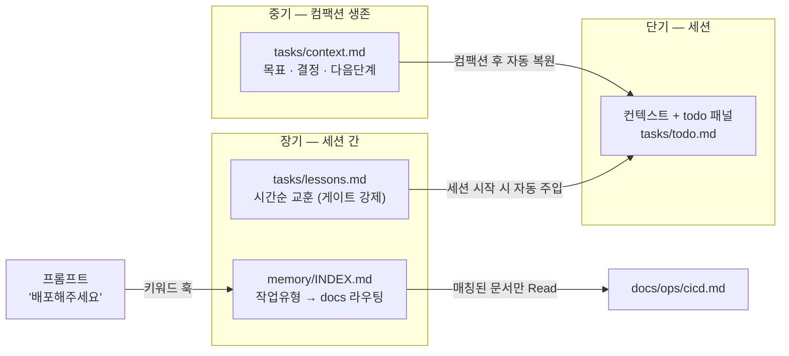
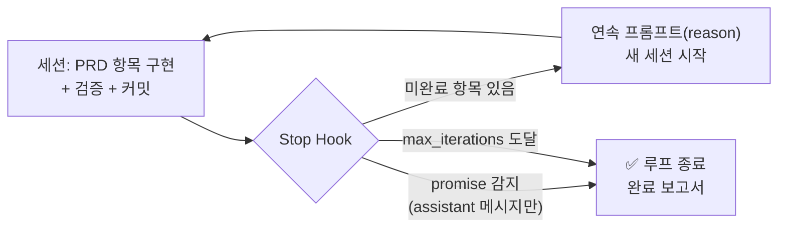

<div align="center">

**🌐 [English](README_EN.md) | 한국어**

# MY Claude Code Harness


[](https://github.com/jh941213/my-cc-harness)
[](LICENSE)
[](#-스킬-43개)
[](#-에이전트-12개)
[](#-hooks-게이트-시스템-20개)
[](#-3계층-메모리-시스템)
[](#-tth-멀티-에이전트-사일로)

### 지시가 아니라 강제한다 — 게이트·메모리·자율 루프 올인원 하네스

`Skills 43` · `Agents 12` · `Commands 4` · `Rules 9` · `Hooks 20` · `3-Tier Memory` · `TTH M7` · `SAST`

</div>

---

## 왜 이 하네스인가

CLAUDE.md에 "~해라"라고 적는 것만으로는 부족하다. 모델은 잊는다. 이 하네스는 세 가지 레이어로 그 문제를 구조적으로 해결한다:

| 레이어 | 무엇을 하나 | 예 |
|---|---|---|
| 🔒 **게이트 (Hooks)** | 어기면 **막힌다** — 지시가 아니라 강제 | 교훈 미기록 시 턴 종료 차단, `.env` 커밋 사전 차단, 태스크 완료 시 품질 게이트 |
| 🧠 **메모리 (3계층)** | 잊지 않는다 — 필요한 것만 로드 | "배포해주세요" → CI/CD 문서 자동 라우팅, 컴팩션 후 작업 상태 자동 복원 |
| 🔁 **자율 루프 (Ralph Loop)** | 밤새 돌아간다 — 완료 조건까지 | PRD 항목 자동 소진(AutoDev), M7 CEO 팀 협업(TTH) |

---

## 목차

- [설치](#-설치)
- [3계층 메모리 시스템](#-3계층-메모리-시스템)
- [Hooks 게이트 시스템 (20개)](#-hooks-게이트-시스템-20개)
- [TTH 멀티 에이전트 사일로](#-tth-멀티-에이전트-사일로)
- [PRD Aletheia v3](#-prd-aletheia-v3)
- [AutoDev — Ralph Loop 자율 개발](#-autodev--ralph-loop-자율-개발)
- [Musk Evaluator](#-musk-evaluator--독립-평가-시스템)
- [고객 제출 산출물 (/client-docs)](#-고객-제출-산출물-client-docs)
- [스킬 (43개)](#-스킬-43개)
- [에이전트 (12개)](#-에이전트-12개)
- [Rules (9개)](#-rules-9개)
- [CLAUDE.md 철학](#-claudemd-철학)
- [디렉토리 구조](#-디렉토리-구조)

---

## 🚀 설치

### 방법 1: 원클릭 설치 (권장)

```bash
curl -fsSL https://raw.githubusercontent.com/jh941213/my-cc-harness/main/install.sh | bash
```

언어 선택(한국어/English) 후 `~/.claude/`에 전체 구성 요소가 설치된다.

### 방법 2: 플러그인 설치

```bash
claude plugin marketplace add jh941213/my-cc-harness
claude plugin install my-cc-harness@my-cc-harness
```

### 방법 3: Claude에게 직접 요청

```
https://github.com/jh941213/my-cc-harness 클론해서 설치해줘.
단, settings.json은 덮어쓰지 말고 내 기존 설정과 병합해줘.
```

> ⚠️ **주의**: `install.sh`는 `~/.claude/settings.json`을 교체한다. 기존 설정(훅·권한·모델)이 있다면 방법 3으로 병합 설치를 권장.

<details>
<summary><b>설치 항목 비교</b></summary>

| 항목 | 방법 1 (스크립트) | 방법 2 (플러그인) | 방법 3 (병합) |
|---|:---:|:---:|:---:|
| CLAUDE.md | ✅ | ❌ | ✅ |
| settings.json (권한·훅 배선) | ✅ 교체 | ❌ | ✅ 병합 |
| skills / commands / agents | ✅ | ✅ | ✅ |
| hooks 스크립트 | ✅ | ✅ | ✅ |
| rules / templates / semgrep | ✅ | ❌ | ✅ |
| team-roles (TTH) | ✅ | ❌ | ✅ |

</details>

### 사전 요구사항 (선택)

```bash
brew install jq ripgrep fd ast-grep difftastic scc gitleaks trivy   # 검증·보안 도구체인
brew install tmux                                                    # TTH 멀티 에이전트용
```

---

## 🧠 3계층 메모리 시스템

**원칙: 지식을 복사하지 않고 라우팅한다. 상시 로드는 인덱스뿐, 본문은 작업이 매칭될 때만.**


```mermaid
flowchart LR
    subgraph 단기["단기 — 세션"]
        A["컨텍스트 + todo 패널<br/>tasks/todo.md"]
    end
    subgraph 중기["중기 — 컴팩션 생존"]
        B["tasks/context.md<br/>목표 · 결정 · 다음단계"]
    end
    subgraph 장기["장기 — 세션 간"]
        C["tasks/lessons.md<br/>시간순 교훈 (게이트 강제)"]
        D["memory/INDEX.md<br/>작업유형 → docs 라우팅"]
    end
    P["프롬프트<br/>'배포해주세요'"] -->|"키워드 훅"| D
    D -->|"매칭된 문서만 Read"| E["docs/ops/cicd.md"]
    B -->|"컴팩션 후 자동 복원"| A
    C -->|"세션 시작 시 자동 주입"| A
```

### 동작 예시

```
사용자: "이제 배포해주세요"
훅:     [auto-memory] "배포/CI" 유형 작업으로 보임 → 시작 전 Read: docs/ops/cicd.md
```

| 계층 | 저장소 | 로드 시점 | 담당 |
|---|---|---|---|
| **단기** | 세션 컨텍스트 + `tasks/todo.md` | 항상 | todo 패널 병행 |
| **중기** | `tasks/context.md` | 컴팩션 직후·세션 재시작 시 **자동 재주입** | `memory-postcompact.sh` |
| **장기 · 일지** | `tasks/lessons.md` | 세션 시작 시 최근 항목 주입 | `lessons-recall.sh` + **Stop 게이트 강제** |
| **장기 · 라우팅** | `memory/INDEX.md` + 기존 `docs/` | **작업 유형 매칭 시에만** 본문 Read | `memory-route-hint.sh` + `auto-memory` 스킬 |

- **2중 라우팅**: 결정적 레이어(키워드 훅이 힌트 한 줄 주입 — 문서 본문은 주입 안 함) + 모델 레이어(스킬이 INDEX를 보고 분류)
- **docs가 진실의 원천**: INDEX는 지도일 뿐, 작업 후 배운 것도 해당 docs를 갱신 (memory 복사 금지)
- ASCII 키워드는 단어 경계 매칭("latest"가 test로 오탐되지 않음), 한글은 조사 대응 부분 매칭

---

## 🔒 Hooks 게이트 시스템 (20개)

**검증은 모델의 선의가 아니라 결정적 게이트가 담당한다.**

### 강제 게이트 (어기면 막힘)

| 훅 | 이벤트 | 강제 내용 |
|---|---|---|
| `lessons-stop-gate.sh` | Stop | 파일 수정 후 `tasks/lessons.md` 미기록 시 **턴 종료 차단** (기록하면 자동 해제, 무한루프 가드) |
| `verify-task-quality.sh` | TaskCompleted | 타입체크·린트·테스트·커버리지·보안 스캔 실패 시 **태스크 완료 차단** |
| 커밋 가드 (인라인) | PreToolUse | `.env` 스테이징·`console.log` 포함 커밋을 **커밋 전** 차단 |
| `config-change-guard.sh` | ConfigChange | 세션 중 CLAUDE.md/rules 변경 시 캐시 보존 경고 |

### 메모리·컨텍스트 훅

| 훅 | 이벤트 | 역할 |
|---|---|---|
| `work-protocol-prompt.sh` | UserPromptSubmit | todo·lessons·context 프로토콜 주입 |
| `memory-route-hint.sh` | UserPromptSubmit | 프롬프트 키워드 → 로드할 docs 힌트 |
| `lessons-recall.sh` | SessionStart | 최근 교훈·작업 상태·메모리 인덱스 주입 |
| `memory-postcompact.sh` / `post-compact-guard.sh` | PostCompact | 중기 메모리 복원 + 컨텍스트 복구 안내 |
| `lessons-track-edit.sh` | PostToolUse | 실작업 추적 (기록성 파일은 제외) |

### 자율 루프·오케스트레이션 훅

| 훅 | 이벤트 | 역할 |
|---|---|---|
| `ralph-loop.sh` | Stop | Ralph Loop 구동 — assistant 메시지에서만 완료 프로미스 감지, 연속 프롬프트 전문을 `reason`으로 전달 |
| `subagent-tracker.sh` / `subagent-stop-tracker.sh` | SubagentStart/Stop | 팀원 스폰·완료 추적 (tmux 재사용) |
| `check-remaining-tasks.sh` | TeammateIdle | 유휴 팀원에게 남은 태스크 배정 |
| `failure-tracker.sh` | PostToolUseFailure | 실패 패턴 축적 |
| `docs-sync.sh` | TaskCompleted | 코드 변경을 `.docs-queue`에 기록 → `/docs sync` |
| `worktree-tracker.sh` | WorktreeCreate/Remove | 워크트리 상태 추적 |
| `autodev-judge.sh` | (수동) | AutoDev 스코어 판정 |

그 외: `notchi-hook.sh`(알림, 선택), `reset-home-memory.sh`(홈 디렉토리 세션 정리), prettier 자동 포맷(인라인).

---

## 🤖 TTH 멀티 에이전트 사일로


**Toss(사일로) + Tesla(제거 우선) + Halo(Ralph Loop) 3축 통합** — M7 CEO 페르소나 팀이 파일 경계를 나눠 병렬 협업한다.

```
/tth 결제 시스템 만들어줘
```

| 페르소나 | 역할 | 파일 경계 (배타적) |
|---|---|---|
| 사티아 (satya) | 오케스트레이터 | 통합·머지 조정 |
| 피차이 (pichai) | 백엔드 | `api/**`, `package.json` **단독** |
| 젠슨 (jensen) | 인프라·타입 | `**/types/**` **단독** |
| 팀 쿡 (tim-cook) | 컴포넌트 인덱스 | `components/**/index.tsx`만 |
| 저커버그 (zuckerberg) | 프론트 구현 | 나머지 `components/**` |
| 베이조스 (bezos) | 데이터·API 계약 | 스키마·계약 |
| 머스크 (musk) | **독립 평가자** | 코드 수정 없음 — 평가만 |

- 팀원은 tmux 세션으로 상주, `SendMessage(to=이름)`로 재사용 (매 라운드 재스폰 금지)
- `CHECKPOINT.md`(마일스톤+검증 커맨드) · `AUDIT.log`(상태 전이) · `progress.txt`(팀 공유 교훈)로 Long-Horizon 실행
- 품질 게이트 실패 시 완료 불가 — 수정 후 재시도가 기본

---

## 📋 PRD Aletheia v3


**인사이트 중심 기획** — 경쟁사·시장·사용자 분석 서브에이전트가 병렬로 조사하고, 근거 있는 PRD 세트를 생성한다.

```
/prd AI 회의록 요약 SaaS
```

- 복잡도 자동 판단: Low(단일 PRD) / Mid(경쟁사 분석 1개 병행) / High(조사 서브에이전트 3개 병렬)
- 출력: `prd/` 디렉토리에 8개 파일 (PRD 본문, 경쟁 분석, 페르소나, 로드맵, 리스크, 지표…)
- `/tth`와 연결하면 PRD → 구현까지 원커맨드 플로우

---

## 🔬 AutoDev — Ralph Loop 자율 개발


**밤새 돌려놓으면 출근 시 PR이 올라와 있다.** Stop Hook이 세션 종료를 가로채 PRD 항목을 하나씩 소진한다.


```mermaid
flowchart LR
    A["세션: PRD 항목 구현<br/>+ 검증 + 커밋"] --> B{"Stop Hook"}
    B -->|"미완료 항목 있음"| C["연속 프롬프트(reason)<br/>새 세션 시작"]
    C --> A
    B -->|"promise 감지<br/>(assistant 메시지만)"| D["✅ 루프 종료<br/>완료 보고서"]
    B -->|"max_iterations 도달"| D
```

- **안전장치**: scope 밖 수정 금지 · 검증 실패 시 롤백 · `autodev/` 브랜치 격리 · max_iterations 상한(사용자 확인 없이 50 초과 금지)
- 단일 완료 조건이면 Claude Code **내장 `/goal`**, PRD 다항목·품질 게이트가 필요하면 **autodev 스킬**
- 병렬 모드(`autodev-parallel`): 워크트리 격리 + cherry-pick 라운드로 독립 항목 동시 구현 (/tth와 동시 사용 금지)

---

## 🚀 Musk Evaluator — 독립 평가 시스템


**같은 모델이 만든 것을 같은 모델이 검증하지 않는다** — 생성자-평가자 분리 원칙.

- 5-Step Engineering Process 기반: 요구사항 의심 → 삭제 → 단순화 → 가속 → 자동화
- AI 슬롭 감지: 과도한 추상화, 죽은 코드, 그럴듯한 미구현
- 판정: SHIP / CONDITIONAL(재평가 최대 3회) / REJECT
- 실행: `/eval` 또는 TTH 파이프라인에서 자동 — gemini CLI·별도 세션·독립 서브에이전트 순으로 교차 모델 검증

---

## 📄 고객 제출 산출물 (/client-docs)

SI/AO 프로젝트의 검수·납품 문서를 **온디맨드로** 생성한다 — 요청한 산출물만, 실제 근거에서만.

```
/client-docs test     # 단위/통합테스트결과서 — 실제 pytest/CI 실행 출력만 사용
/client-docs arch     # 아키텍처설계서 ← docs/ARCHITECTURE.md + 구성도 + ERD
/client-docs rtm      # 요구사항추적표 ← SPEC.md + 구현·테스트 매핑
/client-docs report   # AO 운영보고서 ← AUDIT.log + 장애·변경 기록
```

- **증거 기반**: 실행 안 한 테스트 결과 기재 절대 금지, 미확인 항목은 `[확인 필요]` 표시
- **검수 수준**: 케이스별 상세 별첨, 커버리지 측정 범위 명시(소스 기준 병기), 결재란·추적성 골격 포함
- 고객 양식이 `templates/client/`에 있으면 그 구조를 그대로 따름
- 생성 후 별도 에이전트가 수치 재현으로 사실 대조 — 생성자가 자기 산출물을 채점하지 않는다

---

## 🛠 스킬 (43개)

<details>
<summary><b>프로세스·워크플로우 (20개)</b> — plan, spec, tdd, review, verify, autodev …</summary>

| 스킬 | 역할 |
|---|---|
| `brainstorming` | 모든 창작 작업 전 설계 확정 — 승인 전 구현 금지 게이트 |
| `systematic-debugging` | 근본 원인 4단계 — 수정 3회 실패 시 아키텍처 의심 |
| `plan` | 3단계+ 작업 계획 수립 → `docs/execute-plans/` 영속화 |
| `spec` / `spec-verify` | 심층 인터뷰 → SPEC.md → 별도 세션 검증 |
| `tdd` | RED-GREEN-REFACTOR 사이클 강제 |
| `review` | Codex+Claude 듀얼 리뷰, 심각도 분류, False Positive 규칙 |
| `verify` | 8단계 검증 파이프라인 (타입·린트·테스트·빌드·보안) |
| `e2e-verify` / `e2e-agent-browser` | API/CLI E2E · 브라우저 자동화 E2E |
| `build-fix` | 빌드 에러 복구 — 1회 실패 시 systematic-debugging 전환 |
| `simplify` / `techdebt` | 코드 단순화 · 데드코드/의존성/기술부채 스캔 |
| `commit-push-pr` | 민감 파일 검사 → 커밋 → PR 생성 |
| `handoff` / `compact-guide` | 인수인계 문서 · 컨텍스트 관리 가이드 |
| `frontend` | frontend-developer 컨텍스트로 UI 구현 |
| `eval` | Musk Evaluator 실행 |
| `autodev` / `autodev-parallel` | Ralph Loop 자율 개발 (단일/병렬) |

</details>

<details>
<summary><b>메모리·문서화 (8개)</b> — auto-memory, docs 스위트, client-docs …</summary>

| 스킬 | 역할 |
|---|---|
| `auto-memory` | 작업 유형별 docs 라우팅 — 선택적 메모리 로드 |
| `docs-architecture` | ARCHITECTURE.md + mermaid 구성도 + ADR + ERD |
| `docs-interfaces` | OpenAPI/AsyncAPI 명세 + API CHANGELOG |
| `docs-manuals` | 사용자 매뉴얼(Diátaxis) + 운영 런북 |
| `docs-ci` | 문서 검증 파이프라인 (링크·mermaid·신선도) |
| `client-docs` | 고객 제출 산출물 온디맨드 생성 |
| `harness-audit` / `harness-diagnostics` | 전역 하네스 감사 · 프로젝트 진단 |

</details>

<details>
<summary><b>디자인·스티치 (8개)</b> — stitch 파이프라인, ui-ux-pro-max, nano-banana …</summary>

| 스킬 | 역할 |
|---|---|
| `stitch-design-md` → `stitch-loop` → `stitch-react` | 디자인 명세 → 반복 개선 → React 변환 파이프라인 |
| `stitch-enhance-prompt` | 스티치 프롬프트 강화 |
| `ui-ux-pro-max` | BM25 검색엔진 내장 디자인 DB (스타일 57·팔레트 95·차트 24·스택 12) |
| `nano-banana` | Gemini 이미지 생성 연동 |
| `tailwind-design-system` | Tailwind 디자인 시스템 (v3 기준) |
| `shadcn-ui` | shadcn/ui 컴포넌트 레퍼런스 |

</details>

<details>
<summary><b>패턴 레퍼런스 (7개)</b> — react, fastapi, typescript …</summary>

`api-design-principles` · `async-python-patterns` · `fastapi-templates`(pydantic v2) · `python-testing-patterns` · `react-patterns` · `typescript-advanced-types` · `vercel-react-best-practices`(47개 룰)

</details>

---

## 🤝 에이전트 (12개)

| 에이전트 | 역할 | | 에이전트 | 역할 |
|---|---|---|---|---|
| `planner` | 구현 계획 설계 | | `code-reviewer` | 코드 리뷰 |
| `architect` | 아키텍처 설계 | | `security-reviewer` | 보안 검토 |
| `prd-planner` | PRD 기획 | | `evaluator` | 독립 평가 (Musk) |
| `frontend-developer` | UI 구현 | | `tdd-guide` | TDD 가이드 |
| `docs-writer` | 문서 생성 | | `junior-mentor` | 온보딩 멘토링 |
| `stitch-developer` | 스티치 개발 | | `langchain-specialist` | LangChain 전문 (스킬 별도 설치) |

---

## 📏 Rules (9개)

경로 조건(`paths:`)으로 관련 파일 작업 시에만 로드되는 조건부 규칙:

`coding-style` · `security` · `testing` · `performance` · `git-workflow` · `drift-control` · `cross-model-verification` · `tool-overlap` · `code-review-reception`

> **code-review-reception**: 리뷰 피드백은 구현 전 코드베이스 대조 검증. 수행적 동의("맞습니다!") 금지, 근거 있는 반론 허용.

---

## 📐 CLAUDE.md 철학

> **목표와 제약을 주면 스스로 일하는 동료다. 단, 증거 없는 완료 보고는 인정하지 않는다.**

- **Simplicity First** — 최소 변경, 과도한 추상화 금지
- **No Laziness** — 근본 원인 수정, 디버깅은 systematic-debugging 4단계
- **Scope Discipline** — 조용히 좁히거나 넓히지 않는다
- **Goal-Driven** — 단계 나열 대신 성공 기준 + 검증 루프
- **Design Before Code** — 창작 작업은 brainstorming으로 설계 승인 후 구현
- **증거 기반 완료 보고** — 이 세션의 도구 결과만 근거로. "스태프 엔지니어가 승인할까?"

---

## 📂 디렉토리 구조

```
~/.claude/
├── CLAUDE.md              # 철학·워크플로우·Knowledge Map
├── settings.json          # 권한 + Hooks 배선 (20개 이벤트)
├── skills/       (43)     # 워크플로우·메모리·문서화·디자인·패턴
├── agents/       (12)     # 역할별 서브에이전트
├── commands/     ( 4)     # /tth /prd /docs /client-docs
├── rules/        ( 9)     # 경로 조건부 규칙
├── hooks/        (20)     # 게이트·메모리·루프 스크립트
├── team-roles/   ( 7)     # TTH M7 CEO 페르소나
├── templates/    ( 3)     # CHECKPOINT · AUDIT.log · execute-plan
├── scripts/               # validate-harness.sh · sarif-to-jsonl.py
└── semgrep-rules/         # SAST taint 룰 (ts-express · py-fastapi)

{project}/                 # 프로젝트별 (자동 생성)
├── tasks/                 # todo.md · lessons.md · context.md
├── memory/                # INDEX.md (라우팅 테이블) + 주제 파일
├── docs/                  # /docs 스위트 산출물
└── deliverables/          # /client-docs 산출물
```

---

## 🔍 품질 보증

- `scripts/validate-harness.sh` — frontmatter·JSON·훅 문법·참조 경로·한/영 패리티 7종 검사 (CI 연동)
- 모든 훅은 실제 stdin 페이로드 파이프 테스트를 거침 — "설치됨"과 "동작함"은 다르다
- 전 스킬은 4축 검사 통과: 선언된 도구로 실행 가능한가 / 참조가 실존하는가 / 트리거가 겹치지 않는가 / 훅·CI가 실제 발동하는가

---

<div align="center">

**MIT License** · Made with [Claude Code](https://claude.com/claude-code)

이슈·PR 환영합니다 🙌

</div>
