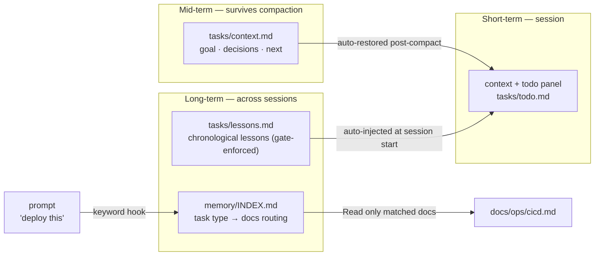
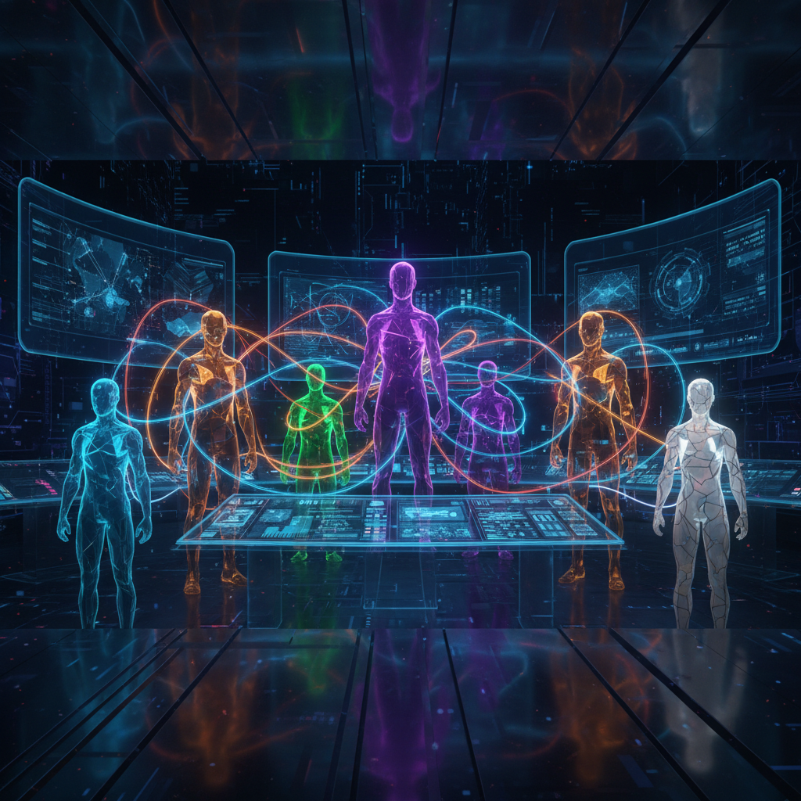
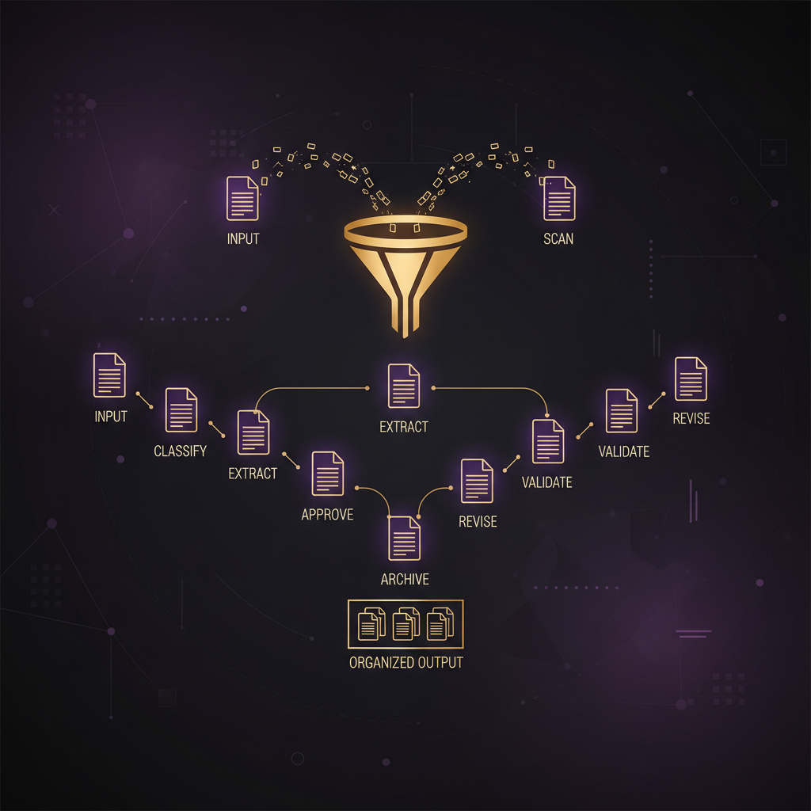
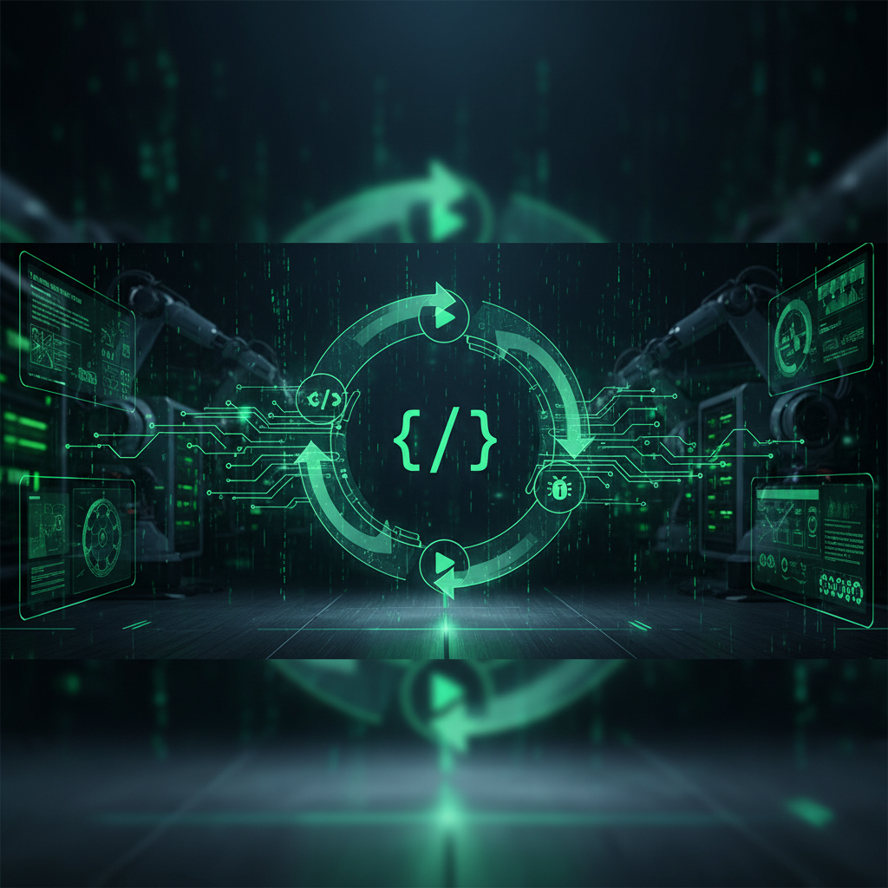
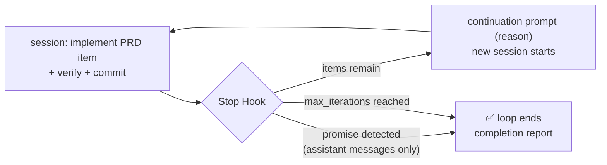
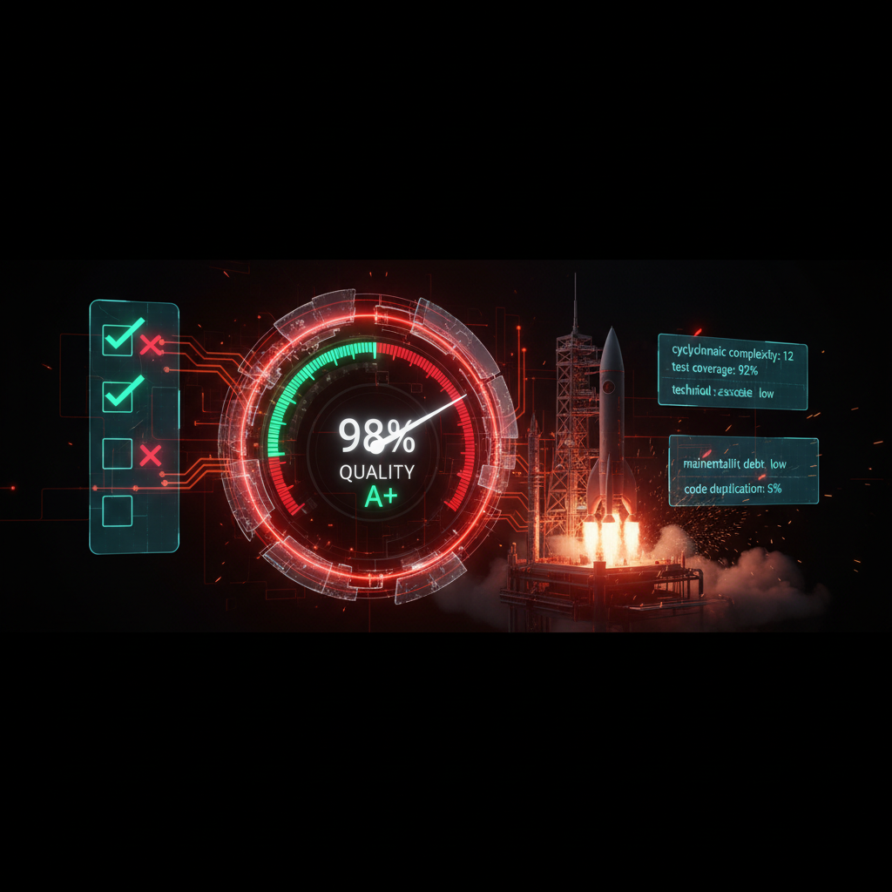

<div align="center">

**🌐 English | [한국어](README.md)**

# MY Claude Code Harness


[](https://github.com/jh941213/my-cc-harness)
[](LICENSE)
[](#-skills-43)
[](#-agents-12)
[](#-hooks-gate-system-20)
[](#-3-tier-memory-system)
[](#-tth-multi-agent-silo)

### Enforce, don't instruct — gates, memory, and autonomous loops in one harness

`Skills 43` · `Agents 12` · `Commands 4` · `Rules 9` · `Hooks 20` · `3-Tier Memory` · `TTH M7` · `SAST`

</div>

---

## Why This Harness

Writing "always do X" in CLAUDE.md is not enough — the model forgets. This harness solves that structurally with three layers:

| Layer | What it does | Example |
|---|---|---|
| 🔒 **Gates (Hooks)** | Violations get **blocked** — enforcement, not instruction | Turn end blocked until lessons are recorded, `.env` commits blocked before they happen, quality gate on task completion |
| 🧠 **Memory (3-tier)** | Nothing gets forgotten — load only what's needed | "deploy this" → CI/CD docs auto-routed, working state auto-restored after compaction |
| 🔁 **Autonomous loops (Ralph Loop)** | Runs overnight — until the done-condition holds | PRD items auto-drained (AutoDev), M7 CEO team collaboration (TTH) |

---

## Table of Contents

- [Installation](#-installation)
- [3-Tier Memory System](#-3-tier-memory-system)
- [Hooks Gate System (20)](#-hooks-gate-system-20)
- [TTH Multi-Agent Silo](#-tth-multi-agent-silo)
- [PRD Aletheia v3](#-prd-aletheia-v3)
- [AutoDev — Ralph Loop](#-autodev--ralph-loop)
- [Musk Evaluator](#-musk-evaluator--independent-evaluation)
- [Client Deliverables (/client-docs)](#-client-deliverables-client-docs)
- [Skills (43)](#-skills-43)
- [Agents (12)](#-agents-12)
- [Rules (9)](#-rules-9)
- [CLAUDE.md Philosophy](#-claudemd-philosophy)
- [Directory Structure](#-directory-structure)

---

## 🚀 Installation

### Method 1: One-click install (recommended)

```bash
curl -fsSL https://raw.githubusercontent.com/jh941213/my-cc-harness/main/install.sh | bash
```

Pick a language (한국어/English) and everything installs into `~/.claude/`.

### Method 2: Plugin install

```bash
claude plugin marketplace add jh941213/my-cc-harness
claude plugin install my-cc-harness@my-cc-harness
```

### Method 3: Ask Claude directly

```
Clone https://github.com/jh941213/my-cc-harness and install it.
Do NOT overwrite settings.json — merge it with my existing settings.
```

> ⚠️ **Warning**: `install.sh` replaces `~/.claude/settings.json`. If you have existing settings (hooks, permissions, model), prefer Method 3 for a merge install.

<details>
<summary><b>What each method installs</b></summary>

| Item | Method 1 (script) | Method 2 (plugin) | Method 3 (merge) |
|---|:---:|:---:|:---:|
| CLAUDE.md | ✅ | ❌ | ✅ |
| settings.json (permissions + hook wiring) | ✅ replace | ❌ | ✅ merge |
| skills / commands / agents | ✅ | ✅ | ✅ |
| hook scripts | ✅ | ✅ | ✅ |
| rules / templates / semgrep | ✅ | ❌ | ✅ |
| team-roles (TTH) | ✅ | ❌ | ✅ |

</details>

### Prerequisites (optional)

```bash
brew install jq ripgrep fd ast-grep difftastic scc gitleaks trivy   # verification & security toolchain
brew install tmux                                                    # for TTH multi-agent
```

---

## 🧠 3-Tier Memory System

**Principle: route knowledge, don't copy it. Only the index is always loaded; bodies are read only when the task matches.**



### In action

```
User: "deploy this to staging"
Hook: [auto-memory] Looks like a "Deploy/CI" task → Read first: docs/ops/cicd.md
```

| Tier | Store | Loaded when | Owner |
|---|---|---|---|
| **Short** | session context + `tasks/todo.md` | always | alongside todo panel |
| **Mid** | `tasks/context.md` | **auto-reinjected** right after compaction & on restart | `memory-postcompact.sh` |
| **Long · journal** | `tasks/lessons.md` | recent entries injected at session start | `lessons-recall.sh` + **Stop gate enforcement** |
| **Long · routing** | `memory/INDEX.md` + existing `docs/` | bodies read **only on task-type match** | `memory-route-hint.sh` + `auto-memory` skill |

- **Dual routing**: deterministic layer (keyword hook injects a one-line hint — never document bodies) + model layer (skill classifies against INDEX)
- **Docs own the truth**: INDEX is just a map; post-task knowledge updates the doc itself (no copying into memory)
- ASCII keywords use word-boundary matching ("latest" never false-triggers "test"); Korean keywords match as substrings (particles attach)

---

## 🔒 Hooks Gate System (20)

**Verification belongs to deterministic gates, not the model's good intentions.**

### Enforcement gates (violations get blocked)

| Hook | Event | Enforces |
|---|---|---|
| `lessons-stop-gate.sh` | Stop | **Blocks turn end** until `tasks/lessons.md` is updated after file-modifying work (auto-clears on write, infinite-loop guard) |
| `verify-task-quality.sh` | TaskCompleted | **Blocks task completion** on typecheck/lint/test/coverage/security failures |
| commit guard (inline) | PreToolUse | Blocks `.env` staging and `console.log` commits **before** the commit happens |
| `config-change-guard.sh` | ConfigChange | Cache-preservation warning on mid-session CLAUDE.md/rules changes |

### Memory & context hooks

| Hook | Event | Role |
|---|---|---|
| `work-protocol-prompt.sh` | UserPromptSubmit | Injects the todo·lessons·context protocol |
| `memory-route-hint.sh` | UserPromptSubmit | Prompt keywords → docs-to-read hint |
| `lessons-recall.sh` | SessionStart | Injects recent lessons, working state, memory index |
| `memory-postcompact.sh` / `post-compact-guard.sh` | PostCompact | Restores mid-term memory + recovery guidance |
| `lessons-track-edit.sh` | PostToolUse | Tracks real work (bookkeeping files excluded) |

### Autonomous loop & orchestration hooks

| Hook | Event | Role |
|---|---|---|
| `ralph-loop.sh` | Stop | Drives the Ralph Loop — detects the completion promise in assistant messages only, delivers the full continuation prompt via `reason` |
| `subagent-tracker.sh` / `subagent-stop-tracker.sh` | SubagentStart/Stop | Teammate spawn/finish tracking (tmux reuse) |
| `check-remaining-tasks.sh` | TeammateIdle | Assigns remaining tasks to idle teammates |
| `failure-tracker.sh` | PostToolUseFailure | Accumulates failure patterns |
| `docs-sync.sh` | TaskCompleted | Queues code changes into `.docs-queue` → `/docs sync` |
| `worktree-tracker.sh` | WorktreeCreate/Remove | Worktree state tracking |
| `autodev-judge.sh` | (manual) | AutoDev score judging |

Also: `notchi-hook.sh` (notifications, optional), `reset-home-memory.sh` (home-dir session cleanup), inline prettier auto-format.

---

## 🤖 TTH Multi-Agent Silo



**Toss (silos) + Tesla (delete first) + Halo (Ralph Loop), unified** — an M7 CEO persona team collaborates in parallel with exclusive file boundaries.

```
/tth build a payment system
```

| Persona | Role | File boundary (exclusive) |
|---|---|---|
| satya | Orchestrator | integration & merge coordination |
| pichai | Backend | `api/**`, `package.json` **solo** |
| jensen | Infra & types | `**/types/**` **solo** |
| tim-cook | Component indexes | `components/**/index.tsx` only |
| zuckerberg | Frontend impl | the rest of `components/**` |
| bezos | Data & API contracts | schemas, contracts |
| musk | **Independent evaluator** | no code edits — evaluation only |

- Teammates persist as tmux sessions, reused via `SendMessage(to=name)` (no respawning every round)
- Long-horizon execution via `CHECKPOINT.md` (milestones + verify commands), `AUDIT.log` (state transitions), `progress.txt` (team lessons)
- Quality-gate failures block completion — fix and retry is the default

---

## 📋 PRD Aletheia v3



**Insight-driven planning** — competitor/market/user research subagents investigate in parallel and produce an evidence-backed PRD set.

```
/prd AI meeting-notes summarization SaaS
```

- Automatic complexity triage: Low (single PRD) / Mid (one competitor-analysis subagent) / High (3 research subagents in parallel)
- Output: 8 files in `prd/` (PRD body, competitive analysis, personas, roadmap, risks, metrics…)
- Chain with `/tth` for a one-command PRD → implementation flow

---

## 🔬 AutoDev — Ralph Loop



**Leave it running overnight; a PR is waiting in the morning.** The Stop Hook intercepts session end and drains PRD items one by one.



- **Safeguards**: no edits outside scope · rollback on verify failure · isolated `autodev/` branch · max_iterations cap (never above 50 without user confirmation)
- Single done-condition → Claude Code's **built-in `/goal`**; PRD multi-item + quality gates → the **autodev skill**
- Parallel mode (`autodev-parallel`): worktree isolation + cherry-pick rounds for independent items (never combine with /tth)

---

## 🚀 Musk Evaluator — Independent Evaluation



**Never verify with the same model that produced the work** — the generator–evaluator separation principle.

- Based on the 5-Step Engineering Process: question requirements → delete → simplify → accelerate → automate
- AI-slop detection: over-abstraction, dead code, plausible-but-unimplemented stubs
- Verdicts: SHIP / CONDITIONAL (max 3 re-evaluations) / REJECT
- Runs via `/eval` or automatically in the TTH pipeline — cross-model verification via gemini CLI → separate session → independent subagent, in that order

---

## 📄 Client Deliverables (/client-docs)

Generates SI/AO acceptance & delivery documents **on demand** — only what was requested, only from real evidence.

```
/client-docs test     # unit/integration test report — actual pytest/CI output only
/client-docs arch     # architecture design doc ← docs/ARCHITECTURE.md + diagrams + ERD
/client-docs rtm      # requirements traceability matrix ← SPEC.md + impl/test mapping
/client-docs report   # AO operations report ← AUDIT.log + incident/change records
```

- **Evidence-based**: recording results of tests that never ran is absolutely forbidden; unverified items are marked `[NEEDS CONFIRMATION]`
- **Acceptance-grade**: per-case detail appendix, coverage measurement scope stated (source-only figure alongside), approval box + traceability skeleton
- If a client template exists in `templates/client/`, its structure is followed exactly
- After generation, a separate agent cross-checks every number — the generator never grades its own deliverable

---

## 🛠 Skills (43)

<details>
<summary><b>Process & workflow (20)</b> — plan, spec, tdd, review, verify, autodev …</summary>

| Skill | Role |
|---|---|
| `brainstorming` | Design settled before any creative work — no implementation before approval |
| `systematic-debugging` | 4-phase root-cause discipline — question the architecture after 3 failed fixes |
| `plan` | Plans for 3+ step work → persisted to `docs/execute-plans/` |
| `spec` / `spec-verify` | Deep interview → SPEC.md → verification in a separate session |
| `tdd` | Enforced RED-GREEN-REFACTOR cycle |
| `review` | Codex+Claude dual review, severity classification, false-positive rules |
| `verify` | 8-stage verification pipeline (types·lint·tests·build·security) |
| `e2e-verify` / `e2e-agent-browser` | API/CLI E2E · browser-automation E2E |
| `build-fix` | Build-error recovery — hands off to systematic-debugging after 1 failed attempt |
| `simplify` / `techdebt` | Code simplification · dead code/deps/debt scanning |
| `commit-push-pr` | Sensitive-file check → commit → PR |
| `handoff` / `compact-guide` | Handover docs · context management guide |
| `frontend` | UI implementation in the frontend-developer context |
| `eval` | Runs the Musk Evaluator |
| `autodev` / `autodev-parallel` | Ralph Loop autonomous development (single/parallel) |

</details>

<details>
<summary><b>Memory & documentation (8)</b> — auto-memory, docs suite, client-docs …</summary>

| Skill | Role |
|---|---|
| `auto-memory` | Task-type docs routing — selective memory loading |
| `docs-architecture` | ARCHITECTURE.md + mermaid diagrams + ADR + ERD |
| `docs-interfaces` | OpenAPI/AsyncAPI specs + API CHANGELOG |
| `docs-manuals` | User manuals (Diátaxis) + ops runbooks |
| `docs-ci` | Docs verification pipeline (links·mermaid·freshness) |
| `client-docs` | On-demand client deliverables |
| `harness-audit` / `harness-diagnostics` | Global harness audit · project diagnostics |

</details>

<details>
<summary><b>Design & Stitch (8)</b> — stitch pipeline, ui-ux-pro-max, nano-banana …</summary>

| Skill | Role |
|---|---|
| `stitch-design-md` → `stitch-loop` → `stitch-react` | Design spec → iterative refinement → React conversion pipeline |
| `stitch-enhance-prompt` | Stitch prompt enhancement |
| `ui-ux-pro-max` | Design DB with built-in BM25 search (57 styles · 95 palettes · 24 charts · 12 stacks) |
| `nano-banana` | Gemini image generation |
| `tailwind-design-system` | Tailwind design system (v3 baseline) |
| `shadcn-ui` | shadcn/ui component reference |

</details>

<details>
<summary><b>Pattern references (7)</b> — react, fastapi, typescript …</summary>

`api-design-principles` · `async-python-patterns` · `fastapi-templates` (pydantic v2) · `python-testing-patterns` · `react-patterns` · `typescript-advanced-types` · `vercel-react-best-practices` (47 rules)

</details>

---

## 🤝 Agents (12)

| Agent | Role | | Agent | Role |
|---|---|---|---|---|
| `planner` | Implementation planning | | `code-reviewer` | Code review |
| `architect` | Architecture design | | `security-reviewer` | Security review |
| `prd-planner` | PRD planning | | `evaluator` | Independent evaluation (Musk) |
| `frontend-developer` | UI implementation | | `tdd-guide` | TDD guidance |
| `docs-writer` | Documentation | | `junior-mentor` | Onboarding mentorship |
| `stitch-developer` | Stitch development | | `langchain-specialist` | LangChain (skills installed separately) |

---

## 📏 Rules (9)

Conditional rules loaded only when matching files are touched (`paths:`):

`coding-style` · `security` · `testing` · `performance` · `git-workflow` · `drift-control` · `cross-model-verification` · `tool-overlap` · `code-review-reception`

> **code-review-reception**: verify review feedback against the codebase before implementing. No performative agreement ("You're right!"); reasoned pushback is allowed.

---

## 📐 CLAUDE.md Philosophy

> **A colleague who works autonomously given goals and constraints. But completion claims without evidence don't count.**

- **Simplicity First** — minimal changes, no over-abstraction
- **No Laziness** — fix root causes; debugging follows systematic-debugging's 4 phases
- **Scope Discipline** — never quietly narrow or widen scope
- **Goal-Driven** — success criteria + verification loops over step lists
- **Design Before Code** — creative work goes through brainstorming approval first
- **Evidence-based completion** — only this session's tool results count. "Would a staff engineer approve this?"

---

## 📂 Directory Structure

```
~/.claude/
├── CLAUDE.md              # philosophy · workflows · Knowledge Map
├── settings.json          # permissions + hook wiring (20 events)
├── skills/       (43)     # workflow · memory · docs · design · patterns
├── agents/       (12)     # role subagents
├── commands/     ( 4)     # /tth /prd /docs /client-docs
├── rules/        ( 9)     # path-conditional rules
├── hooks/        (20)     # gate · memory · loop scripts
├── team-roles/   ( 7)     # TTH M7 CEO personas
├── templates/    ( 3)     # CHECKPOINT · AUDIT.log · execute-plan
├── scripts/               # validate-harness.sh · sarif-to-jsonl.py
└── semgrep-rules/         # SAST taint rules (ts-express · py-fastapi)

{project}/                 # per-project (auto-created)
├── tasks/                 # todo.md · lessons.md · context.md
├── memory/                # INDEX.md (routing table) + topic files
├── docs/                  # /docs suite output
└── deliverables/          # /client-docs output
```

---

## 🔍 Quality Assurance

- `scripts/validate-harness.sh` — 7 checks: frontmatter, JSON, hook syntax, reference paths, KO/EN parity (CI-wired)
- Every hook is pipe-tested with real stdin payloads — "installed" and "working" are different things
- Every skill passes the 4-axis check: executable with its declared tools / references exist / triggers don't overlap / hooks & CI actually fire

---

<div align="center">

**MIT License** · Made with [Claude Code](https://claude.com/claude-code)

Issues & PRs welcome 🙌

</div>
