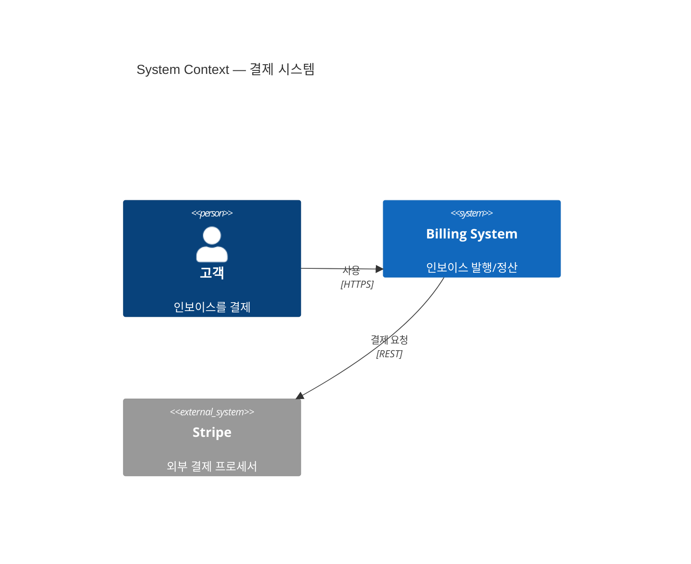
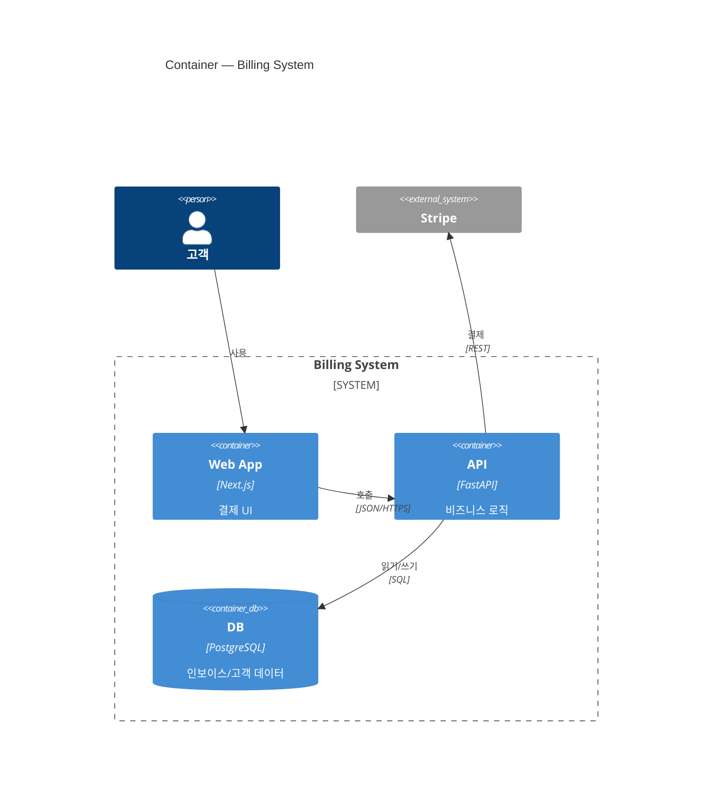
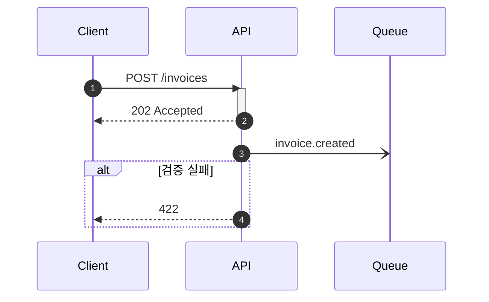
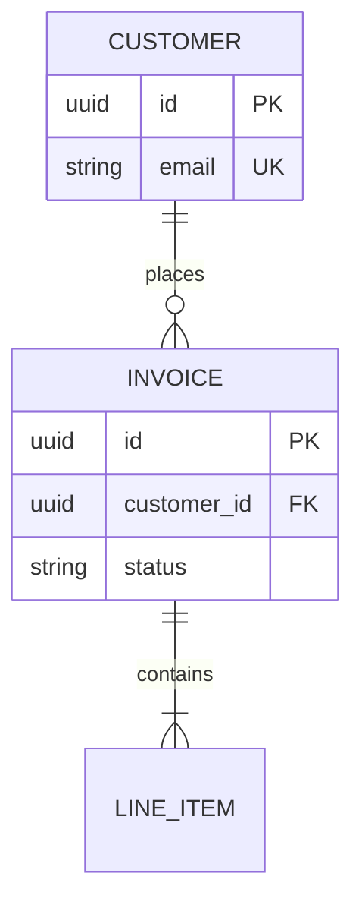
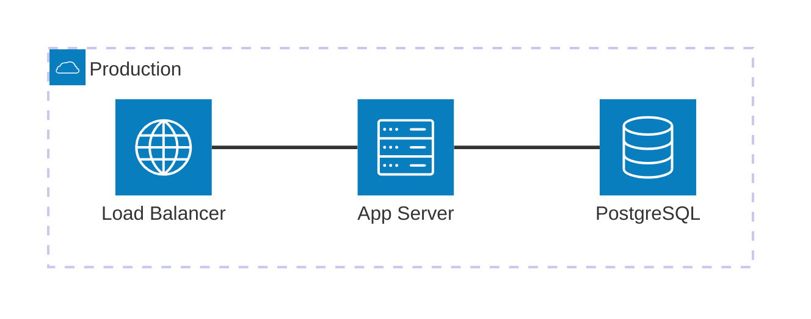

# Mermaid 다이어그램 관례 (docs 스위트 공용)

공통 규칙: 레포 내 ` ```mermaid ` 펜스 블록 사용(GitHub/GitLab 네이티브 렌더), 다이어그램 1개 = 관심사 1개, 노드 15-20개 이하. CI 검증은 `mmdc`(docs-ci 스킬 참조).

## C4 Context — 시스템 컨텍스트 구성도



## C4 Container — 컨테이너 구성도



주의: mermaid C4는 아직 experimental — 위 안정 서브셋만 사용. Component 레벨 상세는 `flowchart TB` + `subgraph`가 레이아웃이 더 좋다.

## Sequence — 인터페이스 흐름도



관례: `autonumber` 항상 사용, participant 상단 선언, `->>` 동기 / `-)` 비동기, 분기는 `alt`/`opt`/`par`.

## ERD — 데이터 모델



관례: 까마귀발 표기(`||` 정확히 1, `o{` 0..N, `|{` 1..N), `PK/FK/UK` 마커, `--` 식별 관계 / `..` 비식별 관계.

## architecture-beta — 인프라/배포 구성도 (v11.1+)



인프라/CI-CD 토폴로지는 architecture-beta 우선, C4 패밀리 안에서 통일하고 싶으면 C4Deployment(`Deployment_Node` 중첩) 사용.
