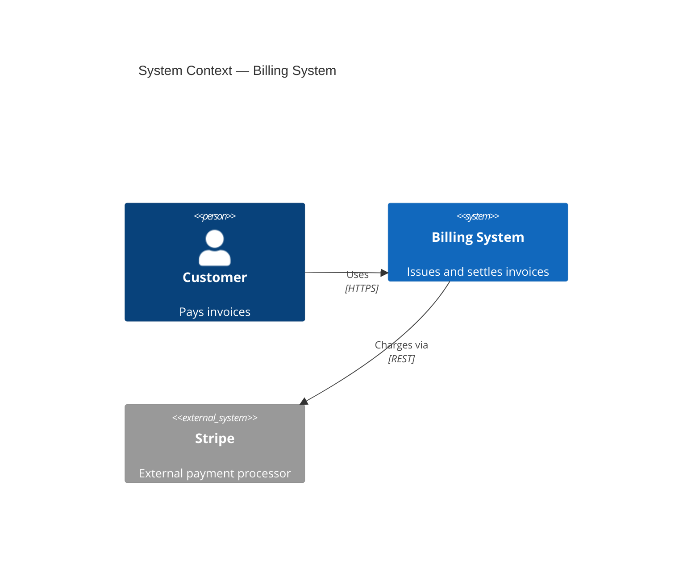
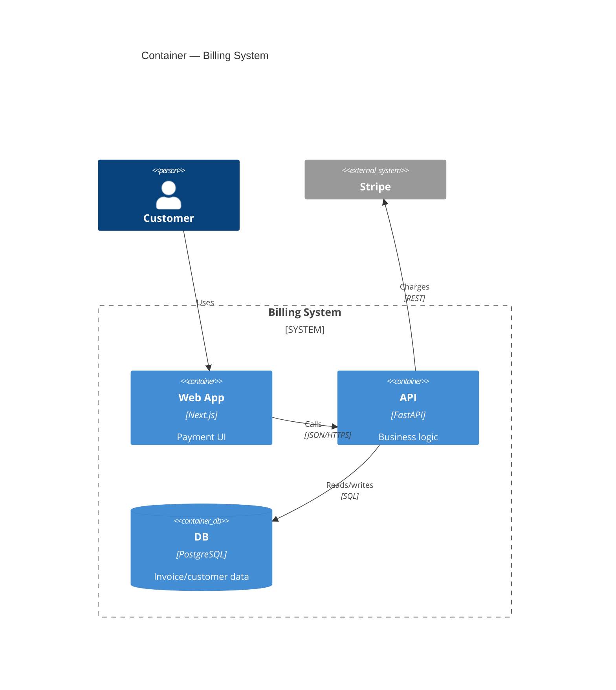
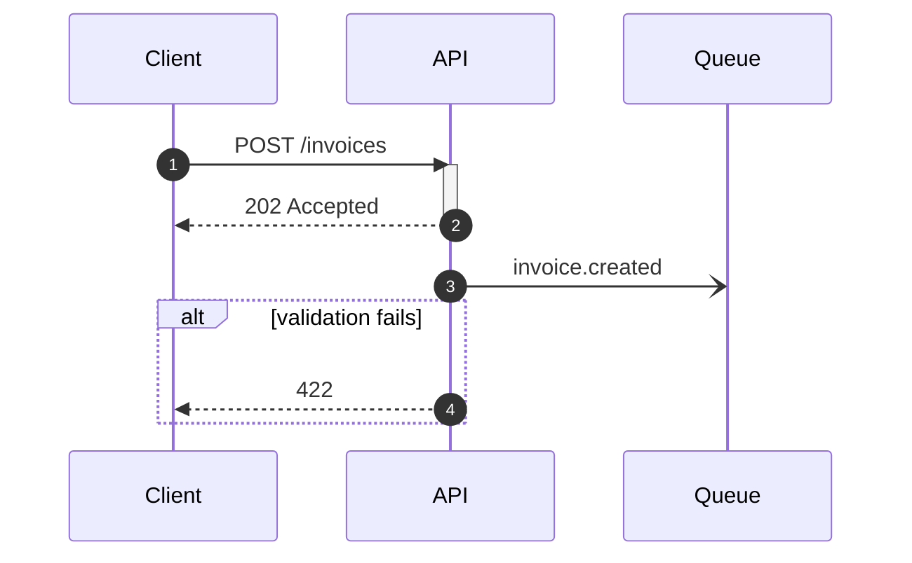
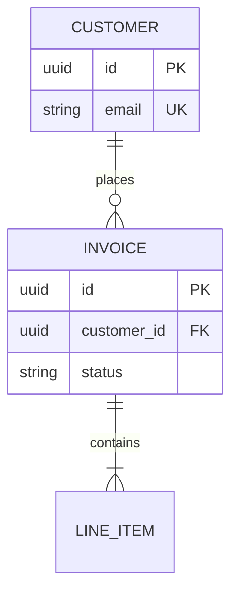
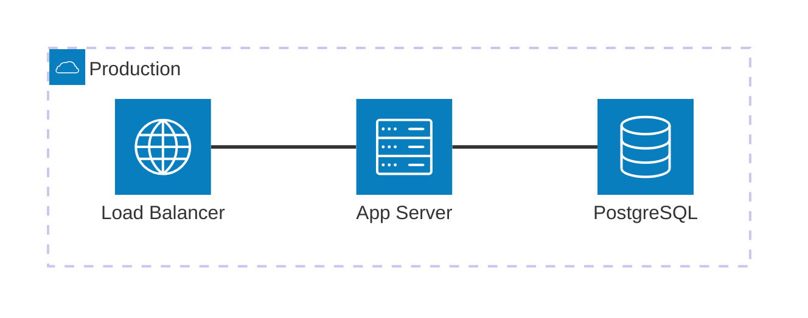

# Mermaid Diagram Conventions (shared across the docs suite)

Common rules: use ` ```mermaid ` fenced blocks in-repo (GitHub/GitLab render natively), 1 diagram = 1 concern, ≤15-20 nodes. CI validation via `mmdc` (see docs-ci skill).

## C4 Context



## C4 Container



Note: mermaid C4 is still experimental — stick to the stable subset above. For Component-level detail, `flowchart TB` + `subgraph` lays out better.

## Sequence — interface flows



Conventions: always `autonumber`, declare participants up front, `->>` sync / `-)` async, branches via `alt`/`opt`/`par`.

## ERD — data model



Conventions: crow's-foot cardinality (`||` exactly one, `o{` zero-or-many, `|{` one-or-many), `PK/FK/UK` markers, `--` identifying vs `..` non-identifying.

## architecture-beta — infra/deployment topology (v11.1+)



Prefer architecture-beta for infra/CI-CD topology; use C4Deployment (`Deployment_Node` nesting) when staying inside the C4 family.
